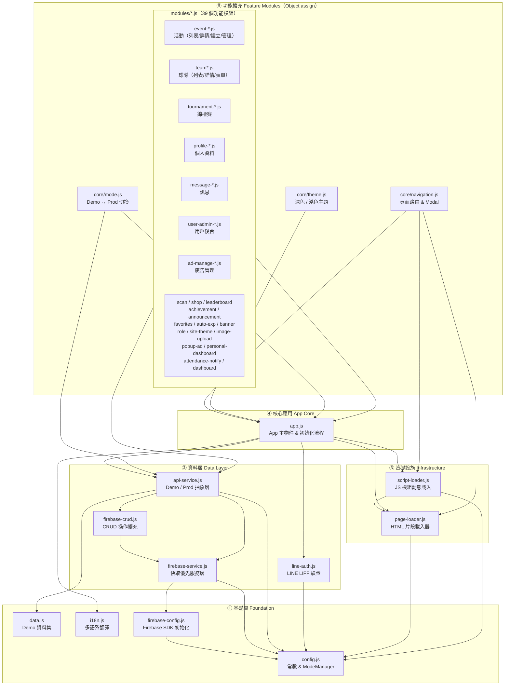

# SportHub — 模組架構圖

## 模組關係圖



## 模組說明

| 模組 | 說明 |
|------|------|
| `config.js` | 全域常數（`ROLES`、`TYPE_CONFIG`、`CACHE_VERSION` 等）與 `ModeManager` 單例，控制 Demo / Prod 模式 |
| `data.js` | 完整的 Demo 靜態資料集，結構與 `FirebaseService._cache` 完全對應，供 Demo 模式渲染使用 |
| `i18n.js` | 多語系翻譯字串，無外部依賴，最先載入 |
| `firebase-config.js` | 初始化 Firebase SDK，向外暴露 `db`、`storage`、`auth` 全域物件 |
| `firebase-service.js` | **快取優先**資料層；以 `_cache` 記憶體物件映射 Firestore，透過 `onSnapshot` 即時同步，並持久化至 localStorage |
| `firebase-crud.js` | 透過 `Object.assign` 擴充 `FirebaseService`，提供各集合的新增 / 更新 / 刪除 / 圖片上傳操作 |
| `api-service.js` | **抽象層**；根據 `ModeManager.isDemo()` 決定從 `DemoData` 或 `FirebaseService._cache` 取資料，隔離所有 UI 模組與 Demo / Prod 切換邏輯 |
| `line-auth.js` | LINE LIFF SDK 封裝；在 Demo 模式或 localhost 時停用，提供登入 / 登出 / 取得個人資料 |
| `page-loader.js` | 按需非同步載入 `pages/*.html` 片段，快取版本由 `CACHE_VERSION` 控制。延遲載入（`_loadDeferred`）與按需載入（`ensurePage`）完成後自動呼叫 `App._bindPageElements()` 重新綁定事件 |
| `script-loader.js` | 定義頁面群組與模組映射；目前所有模組已在 `index.html` 以 `<script defer>` 靜態載入，ScriptLoader 作為保底機制確保頁面切換時模組可用 |
| `app.js` | `App` 主物件；定義 4 階段初始化流程、`renderAll()`、`showToast()`、`appConfirm()` |
| `core/navigation.js` | `showPage()` 頁面路由、Modal 管理、Drawer 開關，透過 `Object.assign` 擴充 App |
| `core/theme.js` | 深色 / 淺色主題切換，偏好儲存於 localStorage |
| `core/mode.js` | Demo ↔ Production 切換（Logo 連按 5 次 / Shift+Alt+D / console 指令），切換時重建 Firebase 監聽器並重繪 UI |
| `modules/event-*.js` | 活動功能群（列表、詳情、報名/取消、同行者 Modal、建立表單、管理、渲染輔助），透過 `Object.assign(App, {...})` 掛載 |
| `modules/team*.js` | 球隊功能群（列表、詳情、表單、成員申請管理） |
| `modules/tournament-*.js` | 錦標賽功能群（渲染、賽程管理） |
| `modules/profile-*.js` | 個人資料功能群（核心 UI、資料編輯、名片彈窗） |
| `modules/message-*.js` | 訊息功能群（收件匣、管理員站內信廣播） |
| `modules/user-admin-*.js` | 用戶後台管理群（列表、EXP 管理、角色權限） |
| `modules/ad-manage-*.js` | 廣告管理群（Banner 輪播、浮動廣告、贊助彈窗） |
| `modules/scan.js` | QR Code 掃描簽到 / 簽退，讀取帳號持有人 UID 後顯示報名清單 |
| `modules/attendance-notify.js` | 被掃方即時通知（Production: Firestore onSnapshot / Demo: 直接觸發） |
| `modules/shop.js` | 二手運動商品市集（刊登、購買、管理） |
| `modules/leaderboard.js` | 用戶 EXP 排行榜 |
| `modules/achievement.js` | 成就 / 徽章系統管理（條件設定、手動頒發） |
| `modules/announcement.js` | 系統公告管理與顯示 |
| `modules/favorites.js` | 用戶收藏活動 / 球隊管理 |
| `modules/auto-exp.js` | 自動 EXP 規則設定（依行為觸發） |
| `modules/banner.js` | 首頁輪播 Banner 渲染 |
| `modules/role.js` | 自訂用戶層級標籤管理 |
| `modules/site-theme.js` | 站點佈景主題設定（管理端） |
| `modules/image-upload.js` | 圖片上傳共用功能（Firebase Storage） |
| `modules/popup-ad.js` | 首頁彈窗廣告顯示邏輯 |
| `modules/personal-dashboard.js` | 個人數據儀表板（參加場次、出席率、EXP 統計） |
| `modules/dashboard.js` | 管理員後台數據儀表板 |

## 初始化流程（4 階段 + 延遲載入回呼）

```
DOMContentLoaded
  │
  ├─ Phase 1（非阻塞）── PageLoader.loadAll()     → 載入 Boot HTML 片段（home / activity / team / profile / message）
  │                        └─ 排程 _loadDeferred() → 背景載入 9 個延遲頁面（scan / tournament / shop / admin-* / personal-dashboard）
  │
  ├─ Phase 2 ── FirebaseService._restoreCache()   → 從 localStorage 還原快取（Prod 模式）
  ├─ Phase 3 ── App.init() → renderAll()          → 立即顯示 UI（使用快取或 Demo 資料）
  │                └─ 隱藏 Loading 遮罩
  │
  ├─ Phase 1 完成 → App.renderAll() + App._bindPageElements()  → 補跑一次渲染與事件綁定
  │
  ├─ _loadDeferred() 完成 → App._bindPageElements()  → 延遲頁面元素事件綁定（如廣告圖片上傳）
  │
  └─ Phase 4（背景 async）
       ├─ 載入 Firebase + LIFF CDN SDK
       ├─ FirebaseService.init()                   → Firestore onSnapshot 即時同步
       └─ LineAuth.init()                          → LINE 登入狀態初始化
```

> Phase 3 在 Phase 1/4 之前完成渲染，確保弱網路環境下不出現白畫面。
> 延遲載入的頁面（admin-content 等）在 DOM 注入後會觸發 `_bindPageElements()` 重新綁定事件。

## Script 載入順序（index.html defer 順序）

```
i18n.js → config.js → data.js → firebase-config.js
  → firebase-service.js → firebase-crud.js → api-service.js → line-auth.js
  → page-loader.js → script-loader.js → app.js
  → core/navigation.js → core/theme.js → core/mode.js
  → [39 個 modules 全部以 <script defer> 靜態載入]
```
