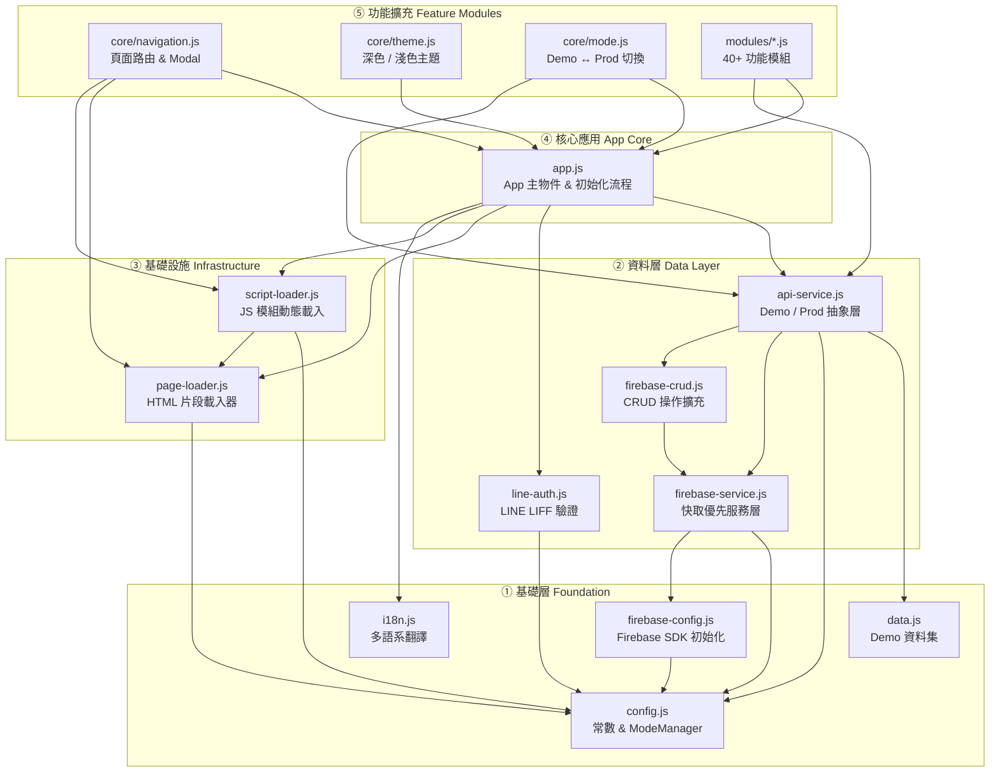

# SportHub — 模組架構圖

## 模組關係圖



## 模組說明

| 模組 | 說明 |
|------|------|
| `config.js` | 全域常數、列舉值（ROLES、TYPE_CONFIG 等）、`ModeManager` 單例，控制 Demo/Prod 模式 |
| `data.js` | 完整的 Demo 靜態資料集，結構與 `FirebaseService._cache` 完全對應，供 Demo 模式使用 |
| `i18n.js` | 多語系翻譯字串，無外部依賴，最先載入 |
| `firebase-config.js` | 初始化 Firebase SDK，向外暴露 `db`、`storage`、`auth` 全域物件 |
| `firebase-service.js` | **快取優先**資料層；以 `_cache` 記憶體物件映射 Firestore，透過 `onSnapshot` 即時同步，並持久化至 localStorage |
| `firebase-crud.js` | 透過 `Object.assign` 擴充 `FirebaseService`，提供各集合的新增 / 更新 / 刪除操作 |
| `api-service.js` | **抽象層**；根據 `ModeManager.isDemo()` 決定從 `DemoData` 或 `FirebaseService._cache` 取資料，隔離所有 UI 模組與 Demo/Prod 切換邏輯 |
| `line-auth.js` | LINE LIFF SDK 封裝；在 Demo 模式或 localhost 時停用，提供登入 / 登出 / 取得個人資料 |
| `page-loader.js` | 按需非同步載入 HTML 片段（pages/*.html），快取版本由 `CACHE_VERSION` 控制 |
| `script-loader.js` | 按頁面群組動態載入 JS 模組，減少首次載入體積 |
| `app.js` | `App` 主物件；定義初始化流程（4 階段）、`renderAll()`、`showToast()`、`appConfirm()` |
| `core/navigation.js` | `showPage()` 頁面路由、Modal 管理，透過 `Object.assign` 擴充 App |
| `core/theme.js` | 深色 / 淺色主題切換，偏好儲存於 localStorage |
| `core/mode.js` | Demo ↔ Production 切換（Logo 連按 5 次 / Shift+Alt+D），切換時重建 Firebase 監聽器並重繪 UI |
| `modules/*.js` | 40+ 功能模組（活動、球隊、錦標賽、個人資料、訊息、商店、掃碼、廣告、管理後台等），全部透過 `Object.assign(App, {...})` 掛載，依賴 `App` 與 `ApiService` |

## 初始化流程（4 階段）

```
DOMContentLoaded
  │
  ├─ Phase 1 ── PageLoader.loadAll()        → 載入 Boot HTML 片段
  ├─ Phase 2 ── FirebaseService._restoreCache() → 從 localStorage 還原快取
  ├─ Phase 3 ── App.init() → renderAll()    → 立即顯示 UI（使用快取資料）
  │
  └─ Phase 4（背景 async）
       ├─ 載入 Firebase + LIFF CDN SDK
       ├─ FirebaseService.init()             → Firestore onSnapshot 即時同步
       └─ LineAuth.init()                   → LINE 登入狀態初始化
```

> Phase 3 在 Phase 4 之前完成渲染，確保弱網路環境下不出現白畫面。
