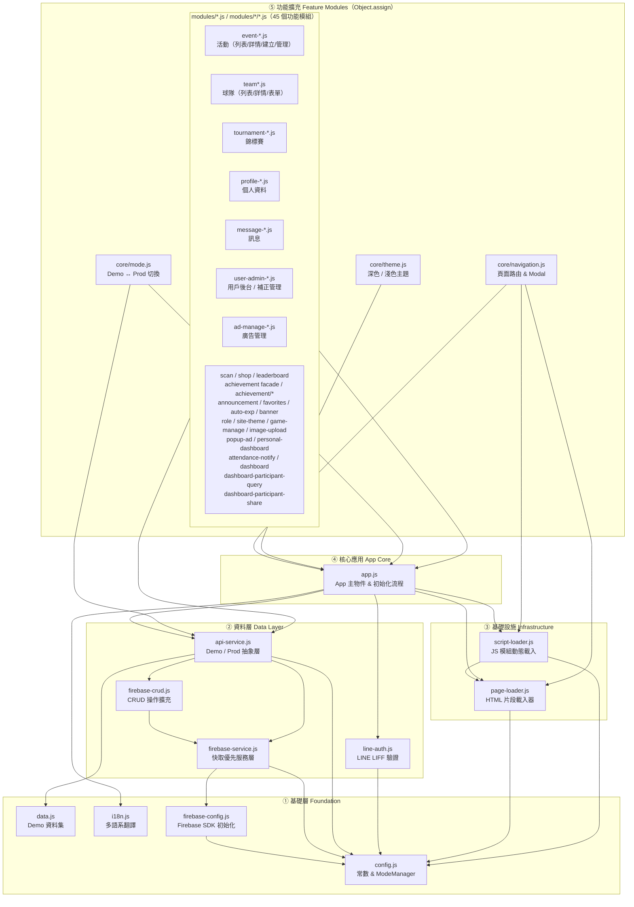
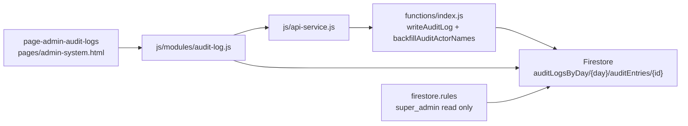

# SportHub — 模組架構圖

## 模組關係圖


```mermaid
flowchart TD
    subgraph F["① 基礎層 Foundation"]
        CONFIG["config.js\n常數 & ModeManager"]
        DATA["data.js\nDemo 資料集"]
        I18N["i18n.js\n多語系翻譯"]
        FB_CFG["firebase-config.js\nFirebase SDK 初始化"]
    end

    subgraph D["② 資料層 Data Layer"]
        FB_SVC["firebase-service.js\n快取優先服務層"]
        FB_CRUD["firebase-crud.js\nCRUD 操作擴充"]
        API["api-service.js\nDemo / Prod 抽象層"]
        LINE["line-auth.js\nLINE LIFF 驗證"]
    end

    subgraph I["③ 基礎設施 Infrastructure"]
        PAGE_LDR["page-loader.js\nHTML 片段載入器"]
        SCRPT_LDR["script-loader.js\nJS 模組動態載入"]
    end

    subgraph C["④ 核心應用 App Core"]
        APP["app.js\nApp 主物件 & 初始化流程"]
    end

    subgraph E["⑤ 功能擴充 Feature Modules（Object.assign）"]
        direction TB
        NAV["core/navigation.js\n頁面路由 & Modal"]
        THEME["core/theme.js\n深色 / 淺色主題"]
        MODE["core/mode.js\nDemo ↔ Prod 切換"]

        subgraph MODS["modules/*.js / modules/*/*.js（45 個功能模組）"]
            EVT["event-*.js\n活動（列表/詳情/建立/管理）"]
            TEAM["team*.js\n球隊（列表/詳情/表單）"]
            TOUR["tournament-*.js\n錦標賽"]
            PROF["profile-*.js\n個人資料"]
            MSG["message-*.js\n訊息"]
            ADM["user-admin-*.js\n用戶後台 / 補正管理"]
            AD["ad-manage-*.js\n廣告管理"]
            UTIL["scan / shop / leaderboard\nachievement facade / achievement/*\nannouncement / favorites / auto-exp / banner\nrole / site-theme / game-manage / image-upload\npopup-ad / personal-dashboard\nattendance-notify / dashboard\ndashboard-participant-query\ndashboard-participant-share"]
        end
    end

    %% Foundation 內部依賴
    FB_CFG --> CONFIG

    %% 資料層依賴
    FB_SVC --> CONFIG
    FB_SVC --> FB_CFG
    FB_CRUD --> FB_SVC
    API --> DATA
    API --> CONFIG
    API --> FB_SVC
    API --> FB_CRUD
    LINE --> CONFIG

    %% 基礎設施依賴
    PAGE_LDR --> CONFIG
    SCRPT_LDR --> CONFIG
    SCRPT_LDR --> PAGE_LDR

    %% App Core 依賴
    APP --> API
    APP --> LINE
    APP --> PAGE_LDR
    APP --> SCRPT_LDR
    APP --> I18N

    %% 功能擴充（Object.assign → App）
    NAV --> APP
    NAV --> PAGE_LDR
    NAV --> SCRPT_LDR
    THEME --> APP
    MODE --> APP
    MODE --> API
    MODS --> APP
    MODS --> API
```

## 模組說明

| 模組 | 說明 |
|------|------|
| `config.js` | 全域常數（`ROLES`、`TYPE_CONFIG`、`CACHE_VERSION` 等）與 `ModeManager` 單例，控制 Demo / Prod 模式 |
| `data.js` | 完整的 Demo 靜態資料集，結構與 `FirebaseService._cache` 完全對應，供 Demo 模式渲染使用 |
| `i18n.js` | 多語系翻譯字串，無外部依賴，最先載入 |
| `firebase-config.js` | 初始化 Firebase SDK，向外暴露 `db`、`storage`、`auth` 全域物件 |
| `firebase-service.js` | **快取優先**資料層；以 `_cache` 記憶體物件映射 Firestore，透過 `onSnapshot` 即時同步，並持久化至 localStorage |
| `firebase-crud.js` | 透過 `Object.assign` 擴充 `FirebaseService`，提供各集合的新增 / 更新 / 刪除 / 圖片上傳操作 |
| `api-service.js` | **抽象層**；根據 `ModeManager.isDemo()` 決定從 `DemoData` 或 `FirebaseService._cache` 取資料，隔離所有 UI 模組與 Demo / Prod 切換邏輯 |
| `line-auth.js` | LINE LIFF SDK 封裝；在 Demo 模式或 localhost 時停用，提供登入 / 登出 / 取得個人資料 |
| `page-loader.js` | 按需非同步載入 `pages/*.html` 片段，快取版本由 `CACHE_VERSION` 控制。延遲載入（`_loadDeferred`）與按需載入（`ensurePage`）完成後自動呼叫 `App._bindPageElements()` 重新綁定事件 |
| `script-loader.js` | 定義頁面群組與模組映射；目前所有模組已在 `index.html` 以 `<script defer>` 靜態載入，ScriptLoader 作為保底機制確保頁面切換時模組可用 |
| `app.js` | `App` 主物件；定義 4 階段初始化流程、`renderAll()`、`showToast()`、`appConfirm()` |
| `core/navigation.js` | `showPage()` 頁面路由、Modal 管理、Drawer 開關，透過 `Object.assign` 擴充 App |
| `core/theme.js` | 深色 / 淺色主題切換，偏好儲存於 localStorage |
| `core/mode.js` | Demo ↔ Production 切換（Logo 連按 5 次 / Shift+Alt+D / console 指令），切換時重建 Firebase 監聽器並重繪 UI |
| `modules/event-*.js` | 活動功能群（列表、詳情、報名/取消、同行者 Modal、建立表單、管理、渲染輔助），透過 `Object.assign(App, {...})` 掛載 |
| `modules/team*.js` | 球隊功能群（列表、詳情、表單、成員申請管理） |
| `modules/tournament-*.js` | 錦標賽功能群（渲染、賽程管理） |
| `modules/tournament/README.md` | 賽事重構預留目錄說明；後續 friendly / cup / league 模組化拆分將以此目錄為落點 |
| `modules/tournament/tournament-core.js` | 賽事共用核心 helper；提供公開賽事頁與後台管理共用的狀態判斷、主辦顯示、友誼賽資料正規化與責任球隊權限骨架 |
| `modules/tournament/tournament-friendly-detail.js` | 友誼賽詳情頁接管模組；處理球隊申請、主辦審核、灰色候審佔位、聯繫主辦人與分享賽事入口 |
| `modules/tournament/tournament-friendly-detail-view.js` | 友誼賽詳情頁渲染模組；處理參加賽事按鈕區、球隊橫向列表、灰色待審列與剩餘名額佔位 |
| `modules/tournament/tournament-friendly-roster.js` | 友誼賽 roster 模組；處理球員名單補載、加入/退出參賽、多隊身份選擇 modal，且只覆蓋 friendly 詳情頁流程 |
| `modules/tournament/tournament-friendly-notify.js` | 友誼賽通知模組；掛接建賽、球隊申請、主辦審核三個節點，透過既有 `notifTemplates/messages` 發送站內信與 LINE 推播 |
| `modules/tournament-manage.js` | 友誼賽第一階段表單與管理入口；處理建立/編輯 modal 的主辦球隊、封面置頂、報名費開關，以及管理列表的權限過濾 |
| `modules/tournament-render.js` | 公開賽事頁與詳情頁 renderer；本階段補上前台建立按鈕刷新、主辦顯示格式與可編輯賽事的詳情入口 |
| `modules/profile-*.js` | 個人資料功能群（核心 UI、資料編輯、名片彈窗） |
| `modules/message-*.js` | 訊息功能群（收件匣、管理員站內信廣播） |
| `modules/user-admin-*.js` | 用戶後台管理群（列表、EXP 管理、角色權限、用戶補正管理；含 `user-admin-corrections.js`） |
| `modules/ad-manage-*.js` | 廣告管理群（Banner 輪播、浮動廣告、贊助彈窗） |
| `modules/scan.js` | QR Code 掃描簽到 / 簽退，讀取帳號持有人 UID 後顯示報名清單 |
| `modules/attendance-notify.js` | 被掃方即時通知（Production: Firestore onSnapshot / Demo: 直接觸發） |
| `modules/shop.js` | 二手運動商品市集（刊登、購買、管理） |
| `modules/leaderboard.js` | 用戶 EXP 排行榜 |
| `modules/achievement.js` | 成就領域 facade；保留舊入口方法名稱，逐步轉接到 `modules/achievement/` 子模組 |
| `modules/achievement/index.js` | 成就領域模組容器；註冊 registry / shared / stats / evaluator 的相容層入口 |
| `modules/achievement/registry.js` | 成就條件 registry；過渡期封裝 `ACHIEVEMENT_CONDITIONS`，供後台欄位與 evaluator 共用 |
| `modules/achievement/shared.js` | 成就共用 helper；包含 threshold、條件描述與分類排序等純函式 |
| `modules/achievement/stats.js` | 成就衍生計算 helper；集中徽章數、已獲得徽章與稱號選項的共用邏輯 |
| `modules/achievement/evaluator.js` | 成就評估器；先承接舊版 `_evaluateAchievements()` 的邏輯，供 facade 轉呼叫 |
| `modules/announcement.js` | 系統公告管理與顯示 |
| `modules/favorites.js` | 用戶收藏活動 / 球隊管理 |
| `modules/auto-exp.js` | 自動 EXP 規則設定（依行為觸發） |
| `modules/banner.js` | 首頁輪播 Banner 渲染 |
| `modules/role.js` | 角色系統、抽屜選單渲染、自訂層級 runtime 等級計算、後台入口權限判斷 |
| `modules/site-theme.js` | 站點佈景主題設定（管理端） |
| `modules/game-manage.js` | 小遊戲管理（首頁顯示開關，預留多款遊戲設定） |
| `modules/image-cropper.js` | 圖片裁切 Modal（拖拽定位 + 縮放 + Canvas 輸出），供 image-upload 與 achievement 呼叫 |
| `modules/image-upload.js` | 圖片上傳共用功能（Firebase Storage），整合 image-cropper 裁切 |
| `modules/popup-ad.js` | 首頁彈窗廣告顯示邏輯 |
| `modules/personal-dashboard.js` | 個人數據儀表板（參加場次、出席率、EXP 統計） |
| `modules/dashboard.js` | 管理員後台數據儀表板 |
| `modules/dashboard-participant-query.js` | 管理員後台活動參與查詢摘要卡（關鍵字、日期區間、符合活動 / 用戶 / 次數摘要、臨時頁入口） |
| `modules/dashboard-participant-share.js` | 活動參與查詢的臨時報表分享模組，負責建立 7 天有效網址與渲染公開快照頁 |

## 初始化流程（4 階段 + 延遲載入回呼）

```
DOMContentLoaded
  │
  ├─ Phase 1（非阻塞）── PageLoader.loadAll()     → 載入 Boot HTML 片段（home / activity / team / profile / message）
  │                        └─ 排程 _loadDeferred() → 背景載入 9 個延遲頁面（scan / tournament / shop / admin-* / personal-dashboard）
  │
  ├─ Phase 2 ── FirebaseService._restoreCache()   → 從 localStorage 還原快取（Prod 模式）
  ├─ Phase 3 ── App.init() → renderAll()          → 立即顯示 UI（使用快取或 Demo 資料）
  │                └─ 隱藏 Loading 遮罩
  │
  ├─ Phase 1 完成 → App.renderAll() + App._bindPageElements()  → 補跑一次渲染與事件綁定
  │
  ├─ _loadDeferred() 完成 → App._bindPageElements()  → 延遲頁面元素事件綁定（如廣告圖片上傳）
  │
  └─ Phase 4（背景 async — 分層啟動）
       ├─ 載入 Firebase + LIFF CDN SDK
       ├─ FirebaseService.init()（分層啟動）
       │    ├─ 立即：boot collections (.get()) + events/teams listeners（公開讀取，不等 Auth）
       │    ├─ 並行：Auth（LINE Custom Token / 匿名）
       │    ├─ init 完成 → 首頁可渲染
       │    ├─ 背景：terminal events listener（公開，非首頁必需）
       │    └─ Auth 完成後：messages + users + rolePermissions listeners → seed
       ├─ LineAuth.init()                          → LINE 登入狀態初始化
       └─ 延遲 listener（進入頁面時）：registrations / attendanceRecords
```

> Phase 3 在 Phase 1/4 之前完成渲染，確保弱網路環境下不出現白畫面。
> Phase 4 的分層啟動讓公開資料（boot + events + teams）不等 Auth 直接載入，大幅減少冷啟動時間。
> 延遲載入的頁面（admin-content 等）在 DOM 注入後會觸發 `_bindPageElements()` 重新綁定事件。

## Script 載入順序（index.html defer 順序）

```
i18n.js → config.js → data.js → firebase-config.js
  → firebase-service.js → firebase-crud.js → api-service.js → line-auth.js
  → page-loader.js → script-loader.js → app.js
  → core/navigation.js → core/theme.js → core/mode.js
  → [40 個 modules 全部以 <script defer> 靜態載入]
```

## 3D Charged Shot Lab (Phase 0, private route)

- Entry page: `game-lab.html` (not linked in main navigation; token-gated).
- Runtime modules:
  - `js/modules/shot-game-engine.js`
  - `js/modules/shot-game-lab-page.js`
- External dependency:
  - `three.js r128` via CDN in `game-lab.html`.
- Data flow (Phase 0):
  1. `ShotGameLabPage` validates query token (`?t=`) against SHA-256 hash.
  2. On success, `ShotGameEngine` initializes and runs in `#shot-game-container`.
  3. On game over, local metrics are written to localStorage key `sporthub_shot_game_lab_metrics_v1`.
  4. Test panel renders summary and supports JSON export/reset.
- Separation boundary:
  - No Firestore write/read in Phase 0.
  - No `Object.assign(App, ...)` hook yet; formal App modal integration is planned for Phase 1.

## Audit Log Additions (2026-03-09)

- New Cloud Functions: `functions/index.js` exports `writeAuditLog` and `backfillAuditActorNames`
  - Trusted write path for audit events
  - Adds `dayKey`, `timeKey`, `actorUid`, `actorRole`, `createdAt`, `expiresAt`
  - Writes to `auditLogsByDay/{yyyyMMdd}/auditEntries/{logId}`
- New frontend module: `js/modules/audit-log.js`
  - `super_admin` single-day audit log page
  - Local filters for time range, nickname or UID, and action
  - No realtime listener and no localStorage persistence
- New admin route:
  - `page-admin-audit-logs`
  - Fragment source: `pages/admin-system.html`
  - Lazy script group: `adminSystem`


```mermaid
flowchart LR
    UI["page-admin-audit-logs\npages/admin-system.html"]
    MOD["js/modules/audit-log.js"]
    API["js/api-service.js"]
    CF["functions/index.js\nwriteAuditLog + backfillAuditActorNames"]
    FS["Firestore\nauditLogsByDay/{day}/auditEntries/{id}"]
    RULES["firestore.rules\nsuper_admin read only"]

    UI --> MOD
    MOD --> API
    API --> CF
    CF --> FS
    MOD --> FS
    RULES --> FS
```

## Admin Log Center Update (2026-03-10)

- New frontend module: `js/modules/admin-log-tabs.js`
  - Merges operation logs, audit logs, and error logs into the single route `page-admin-logs`
  - Builds tabbed panels at runtime from `pages/admin-system.html`
  - Keeps legacy routes `page-admin-audit-logs` and `page-admin-error-logs` as aliases that redirect to the same page with the matching tab
- Updated route dependencies:
  - `page-admin-logs` now lazy-loads both `adminUsers` and `adminSystem`
  - `page-admin-logs` now preloads both `operationLogs` and `errorLogs`
- UI behavior:
  - Left drawer now exposes one entry only: log center

## Admin Drawer Permission Update (2026-03-10)

- `js/config.js`
  - 新增後台抽屜入口對應的權限碼定義（例如 `admin.dashboard.entry`、`admin.games.entry`）
  - 內建權限分類改以抽屜入口名稱為分類標題，且每個分類至少包含 `顯示入口`
  - 權限分類排序直接沿用抽屜順序，包含「活動管理」與「賽事管理」入口
  - 內建角色 / 自訂角色的 runtime 等級與顏色資訊改由動態序列計算，不再只靠固定 `ROLE_LEVEL_MAP`
- `js/modules/role.js`
  - 只要抽屜入口有 `permissionCode`，就改由權限碼單獨控制顯示與進頁，不再受 `minRole` 限制
  - `showPage()` 與頁面根節點顯示共用同一套頁面權限判斷，避免手動切頁繞過抽屜隱藏
- `js/modules/user-admin-roles.js`
  - 自訂層級列表排序改用 runtime 序列，支援「自訂層級插在自訂層級之後」
  - 權限面板改由內建 catalog + Firestore `permissions` 合併渲染
  - 新增「儲存成預設」與「只顯示已有權限」操作，並把 `rolePermissions.defaultPermissions` 作為各層級重置來源
  - `super_admin` 權限開關在 UI 層固定鎖定，避免誤觸關閉抽屜入口或其他權限
- `js/firebase-service.js`
  - `rolePermissions` 即時監聽新增 catalog metadata，並同步讀取 `defaultPermissions`
  - `super_admin` 登入時會做一次後台入口權限補遷移，避免舊的 admin / super_admin 在新入口權限上線後瞬間失去抽屜入口
- Inside the page, tabs switch between operation, audit, and error logs without leaving the route

## Participant Query Temporary Share (2026-03-10)

- New frontend module: `js/modules/dashboard-participant-share.js`
  - Adds the dashboard action that snapshots participant-query results into a short-lived share report
  - Renders the public route `page-temp-participant-report` from `?rid=<shareId>#page-temp-participant-report`
- New data model:
  - `participantQueryShares/{shareId}`
  - `participantQueryShares/{shareId}/shareItems/{itemId}`
- Access model:
  - Only `admin / super_admin` can create report snapshots
  - Anyone with the URL can read a ready, unexpired snapshot
  - Public page hides `UID` and only exposes display name, count, recent date, and matched events
- Lifecycle:
  - Reports are query-time snapshots, not live reruns
  - Each snapshot carries `expiresAt` and is intended to expire after 7 days

## Realtime Scope Update (2026-03-09)

- `events` and `teams` are no longer boot-time global realtime listeners.
- Homepage, teams, and tournament pages now rely on static `.get()` loads through `FirebaseService.ensureCollectionsForPage()`.
- True page-scoped realtime is kept only for activity-sensitive pages:
  - `page-activities`
  - `page-activity-detail`
  - `page-my-activities`
  - `page-scan`
- The page-scoped realtime collections are:
  - `registrations`
  - `attendanceRecords`
- `js/core/navigation.js` now finalizes page-scoped listeners on route changes so activity listeners do not stay subscribed after leaving those pages.

## Audit / Error Log Display Update (2026-03-09)

- Audit logs now resolve display names with two layers:
  - Cloud Function `writeAuditLog` prefers `users.uid`, user profile name, and Firebase Auth `displayName`
  - Admin audit log UI locally falls back to `adminUsers` cache when old entries only stored `actorUid`
- Super admin can trigger `backfillAuditActorNames` for a selected audit day to write missing `actorName` values back into `auditLogsByDay/{day}/auditEntries/{id}`.
- Error log UI now translates common Firebase / network errors into Chinese at render time and derives a severity badge:
  - `嚴重`
  - `警告`
  - `一般`
- The Chinese translation and severity are display-layer derived, so existing historical `errorLogs` entries benefit without Firestore migration.

## Users Self-Update Security Boundary (2026-03-09)

- `users/{userId}` 的自助更新責任已拆成三條規則路徑：
  - 一般個人資料更新：`isSafeSelfProfileUpdate`
  - 登入更新格式：`isSafeLoginUpdate`
  - 球隊欄位退出流程：`isTeamFieldShrinkOrClear`
- 最後登入時間（`lastLogin`）不再允許夾帶於一般個人資料更新；只接受登入更新格式，且值必須等於 `request.time`。
- 更新時間（`updatedAt`）在自助更新與隊職員跨使用者球隊調整中，皆改為只接受 `request.time`，避免客戶端偽造任意 Timestamp。
- 球隊欄位（`teamId`、`teamName`、`teamIds`、`teamNames`）已自一般個人資料白名單移除：
  - 一般使用者不可自行填入新球隊歸屬
  - 一般使用者只能全清或把既有 `teamIds` 縮減為嚴格子集
- 前端的退出球隊（`handleLeaveTeam`）沿用既有多球隊 shrink 邏輯；刪除球隊（`deleteTeam`）則補上 secondary team 清理，避免只清主球隊造成殘留引用。
