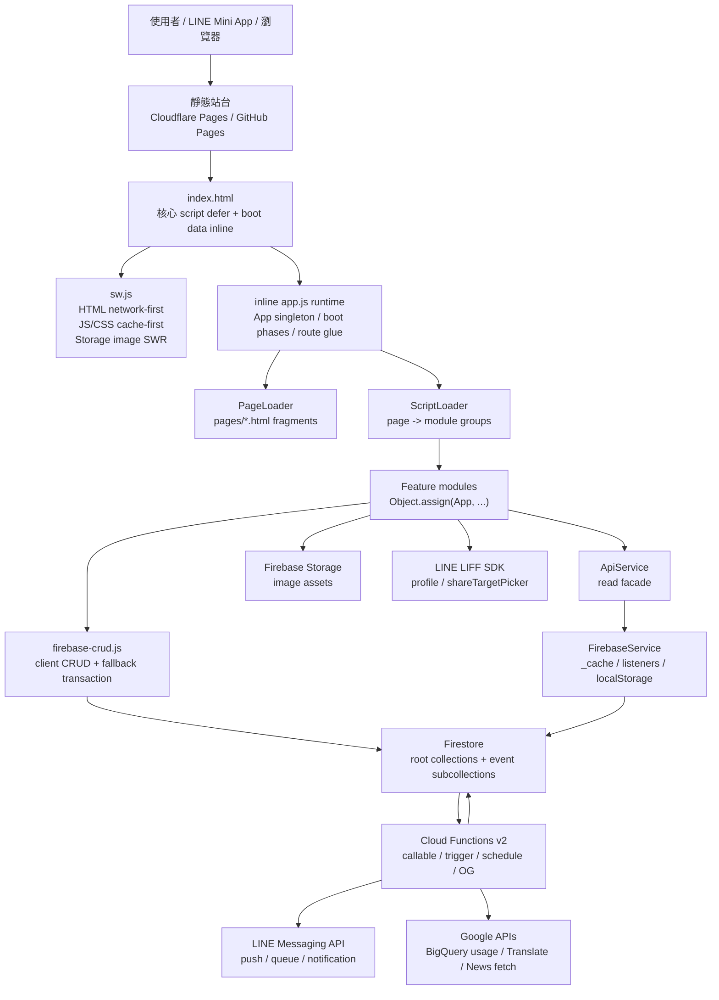
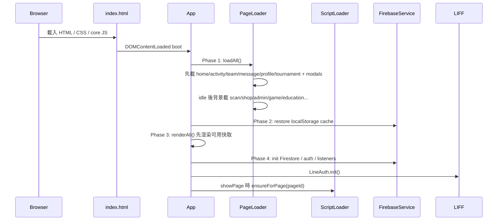
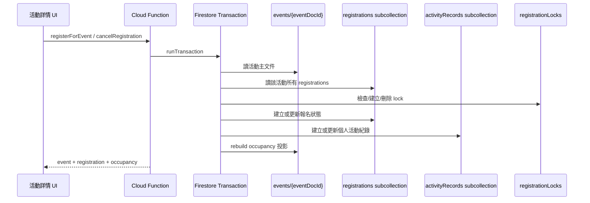

# ToosterX 現況架構文件

## 2026-05-16 臨時營運 LTV 報表

- **入口**：`https://toosterx.com/ops-report`（同頁也可用 `/ops-report.html`）。專案不維護 `ops.toosterx.com`、`ltv.toosterx.com`、`report.toosterx.com` 等子域名路由。
- **用途**：提供臨時獨立 HTML 營運報表，用來查看 DNU、DAU、WAU、MAU、區間活躍、新用戶回訪率、次日 / 7 日 / 30 日留存與每日趨勢。
- **權限**：前端頁面只負責登入與呈現；真正資料讀取一律透過 `getOpsLtvReport` Callable Function，由後端 `getCallerAccessContext()` 檢查 `admin` 以上層級。
- **資料來源**：後端讀 `users` 取得建立日與 `lastLogin` 補強，讀 `auditLogsByDay/{YYYYMMDD}/auditEntries` 的 `login_success` 作為主要活躍來源。前端不得直接掃描 Firestore 產生報表。
- **成本控制**：查詢區間最多 180 天；回傳內容包含估算讀取量（`usersRead + auditEntryReads`），供營運判斷報表成本。
- **檔案**：`ops-report.html`、`functions/ops-ltv-report.js`、`functions/index.js#getOpsLtvReport`、`_worker.js`、`_routes.json`、`_headers`。

> Last audited: 2026-05-16
> 依據實際程式碼盤點：`index.html`、`app.js`、`js/`、`pages/`、`functions/index.js`、`firestore.rules`、`firebase.json`、`package.json`、`tests/`、近期 git history。
> 本文件描述「目前專案真的怎麼運作」，不是未來計劃書。若與舊文件或記憶有衝突，以目前程式碼為準。

---

## 一句話總覽

ToosterX 是一個 LINE LIFF + Firebase 的 buildless Vanilla JS SPA。前端由 `index.html` 直接載入核心腳本，`PageLoader` 按需載入 `pages/*.html`，`ScriptLoader` 再依頁面載入功能模組；資料層以 Firestore 為主，活動報名、簽到、個人紀錄已遷移到 `events/{eventDocId}/...` 子集合，關鍵一致性由 `asia-east1` Cloud Functions transaction 與 Firestore rules 共同保護。

---

## 快速盤點

| 項目 | 現況 |
|---|---|
| 前端型態 | Vanilla JS / HTML / CSS，無 webpack、無 build step |
| 主入口 | `index.html` + inline `app.js` runtime |
| HTML fragments | `pages/` 共 20 個頁面片段 |
| JS 檔案 | `js/` 共 289 個 JS |
| 功能模組 | `js/modules/` 共 274 個 JS，16 個子資料夾 + 29 個 root-level shared module |
| CSS | `css/` 共 18 個 CSS |
| 後端 | Firebase Cloud Functions v2，Node.js 22，主要 region `asia-east1` |
| Cloud Functions exports | 67 個 |
| 資料庫 | Firestore，rules 約 1600 行 |
| Storage | Firebase Storage，含 default bucket 與 asia-east1 bucket target |
| 驗證 | LINE LIFF profile + Firebase Custom Token |
| 佈署 | 前端 push `main` 後由 Cloudflare Pages / GitHub Pages 發佈；functions/rules 需 Firebase deploy |
| 測試 | Jest unit、Firestore rules emulator、Playwright e2e smoke |
| 目前快取版本 | `0.20260519zb` |

近期身份、權限與錯誤診斷變更索引：`docs/specs/recent-updates-20260519.md`。

---

## 高層拓樸


```mermaid
flowchart TD
    U["使用者 / LINE Mini App / 瀏覽器"]
    H["靜態站台\nCloudflare Pages / GitHub Pages"]
    IDX["index.html\n核心 script defer + boot data inline"]
    SW["sw.js\nHTML network-first\nJS/CSS cache-first\nStorage image SWR"]
    APP["inline app.js runtime\nApp singleton / boot phases / route glue"]
    PL["PageLoader\npages/*.html fragments"]
    SL["ScriptLoader\npage -> module groups"]
    MOD["Feature modules\nObject.assign(App, ...)"]
    API["ApiService\nread facade"]
    FSVC["FirebaseService\n_cache / listeners / localStorage"]
    CRUD["firebase-crud.js\nclient CRUD + fallback transaction"]
    CF["Cloud Functions v2\ncallable / trigger / schedule / OG"]
    DB["Firestore\nroot collections + event subcollections"]
    ST["Firebase Storage\nimage assets"]
    LIFF["LINE LIFF SDK\nprofile / shareTargetPicker"]
    LINE["LINE Messaging API\npush / queue / notification"]
    EXT["Google APIs\nBigQuery usage / Translate / News fetch"]

    U --> H --> IDX
    IDX --> SW
    IDX --> APP
    APP --> PL
    APP --> SL
    SL --> MOD
    MOD --> API
    MOD --> CRUD
    API --> FSVC
    CRUD --> DB
    FSVC --> DB
    MOD --> LIFF
    MOD --> ST
    CF --> DB
    CF --> LINE
    CF --> EXT
    DB --> CF
```

---

## Runtime 與部署邊界

### 前端

- `index.html` 是唯一主要 SPA 入口，直接 `<script defer>` 載入核心與 boot 必要模組。
- `pages/*.html` 是頁面片段，不是獨立 route。
- `index.html` 內嵌 `app.js` runtime 來建立全域 `App` singleton，其他模組透過 `Object.assign(App, {...})` 擴充。
- `js/config.js` 保存 runtime 常數、角色、權限 catalog、運動標籤、頁面策略、快取版本。
- 沒有 npm build。`package.json` 只提供測試腳本。

### 後端

- `functions/index.js` 是 Cloud Functions 主檔，Node.js 22。
- 所有前端 callable 都應使用 `firebase.app().functions('asia-east1')` 呼叫，避免 region mismatch。
- 關鍵寫入路徑包含活動報名、取消報名、團隊席位、賽事友誼賽流程、資料同步、UID 健康檢查、放鴿子計算、登入 IP 紀錄。

### 暫停中的功能

- 放鴿子功能目前暫時軟關閉（2026-05-09）：前端 `js/config.js` 與後端 `functions/index.js` 的 `NO_SHOW_FEATURE_ENABLED` 都是 `false`。
- 關閉期間活動詳細頁不顯示放鴿子欄位，用戶補正管理不顯示放鴿子頁籤，資料同步不開放放鴿子重算，Cloud Function 排程與手動 callable 不會重算 `noShowCount`，Auto EXP 不執行 `noshow_penalty`。
- 歷史資料保留不刪除；恢復功能時需前後端 flag 同步改回 `true`、更新 cache version、部署 functions，並跑 no-show 權限/統計測試。

### 部署

- 前端文件、HTML、JS、CSS：`git push origin main` 後由靜態站台部署。
- Cloud Functions：`firebase deploy --only functions --project fc-football-6c8dc`。
- Firestore Rules：`firebase deploy --only firestore:rules --project fc-football-6c8dc`。
- Firestore Indexes：`firebase deploy --only firestore:indexes --project fc-football-6c8dc`，只有 indexes 變更時需要。
- docs-only 變更不需要 bump `CACHE_VERSION`，也不需要 functions/rules deploy。

---

## 啟動流程


```mermaid
sequenceDiagram
    participant Browser
    participant Index as index.html
    participant App
    participant PageLoader
    participant ScriptLoader
    participant FirebaseService
    participant LIFF

    Browser->>Index: 載入 HTML / CSS / core JS
    Index->>App: DOMContentLoaded boot
    App->>PageLoader: Phase 1: loadAll()
    PageLoader->>PageLoader: 先載 home/activity/team/message/profile/tournament + modals
    PageLoader->>PageLoader: idle 後背景載 scan/shop/admin/game/education...
    App->>FirebaseService: Phase 2: restore localStorage cache
    App->>App: Phase 3: renderAll() 先渲染可用快取
    App->>FirebaseService: Phase 4: init Firestore / auth / listeners
    App->>LIFF: LineAuth.init()
    App->>ScriptLoader: showPage 時 ensureForPage(pageId)
```

### 啟動設計重點

- `PageLoader._bootPages`：`home`、`activity`、`team`、`message`、`profile`、`tournament`。
- `PageLoader._deferredPages`：`scan`、`shop`、admin 系列、`personal-dashboard`、`game`、`kickball`、`education` 等。
- deep link 會讓 `PageLoader` 優先載入目標頁片段，例如活動、俱樂部、賽事。
- `ScriptLoader._pageGroups` 把 page id 對應到模組群組，避免所有功能一次載完。
- `Service Worker` 與目前 `CACHE_VERSION`（現行 `0.20260519zb`）控制前端快取更新。

---

## Script 載入分層

### index.html 直接載入的核心

核心順序大致如下：

1. `js/i18n.js`
2. `js/config.js`
3. `js/firebase-config.js`
4. `js/firebase-service.js`
5. `js/firebase-crud.js`
6. `js/api-service.js`
7. `js/identity-resolver.js`
8. `js/line-auth.js`
9. `js/core/page-loader.js`
10. `js/core/script-loader.js`
11. `app.js`
12. `js/core/navigation.js`
13. `js/core/theme.js`
14. `js/core/button-loading.js`
14. 常用 shared modules：PWA、多分頁 guard、圖片裁切/上傳、sync-status、role、profile core、banner、popup、announcement、site theme、首頁摘要儀表與 message 基礎等。

### ScriptLoader 主要群組

| 群組 | 用途 |
|---|---|
| `activity` | 活動列表、活動詳情、報名/取消/候補、同行者、活動建立、分隊、簽到管理、報名稽核 |
| `activityCalendar` | 活動行事曆、月曆格、日期導覽、運動數量標籤 |
| `activityMap` / `eventLocationPicker` | 手動觸發的附近活動地圖與活動場地定位 picker；列入 manual-only group，不進 idle preload |
| `teamList` | 俱樂部列表與卡片 |
| `teamDetail` | 俱樂部內頁、俱樂部動態、俱樂部活動、邀請、分享 |
| `teamForm` | 建立/編輯俱樂部表單、搜尋、驗證、職員欄位 |
| `tournamentList` | 賽事列表與卡片 |
| `tournamentDetail` | 賽事詳情、友誼賽報名、隊伍成員 roster、通知、分享 |
| `tournamentAdmin` | 建立/編輯賽事、主辦俱樂部、委託人、裁判、host participates |
| `profile` | 個人資訊、統計、報名紀錄、個人資料編輯 |
| `message` / `messageAdmin` | 使用者收件匣、私訊對話、後台訊息管理 |
| `scan` | QR 掃描、簽到/簽退、家人/代理 |
| `adminDashboard` | 數據儀表板、用量、drilldown、參與者查詢與分享 |
| `adminUsers` | 用戶管理、EXP、角色、補正、黑名單、UID 檢查、資料同步 |
| `adminSystem` | 遊戲設定、log center、error/audit/chat audit log |
| `adminContent` | 首頁管理、首頁排版順序、banner、浮動廣告、彈窗贊助、boot brand |
| `adminSeo` | SEO dashboard / snapshot |
| `education` | 教學/課程/學生/課表/簽到/家長綁定 |
| `achievement` | 成就、稱號、EXP evaluator、徽章、管理 |
| `game` / `kickball` / `profileScene` | 互動遊戲與 2D 場景 |

---

## 主要前端模組

| 目錄 | JS 數 | 角色 |
|---|---:|---|
| `event/` | 46 | 活動列表、行事曆、詳情、建立、場地定位、附近活動地圖、報名、候補、同行者、團隊席位、分隊、簽到管理、活動生命週期 |
| `team/` | 16 | 俱樂部列表、內頁、動態、俱樂部活動、邀請、分享、建立/編輯、職員與運動標籤 |
| `tournament/` | 19 | 賽事列表、詳情、友誼賽隊伍報名、主辦俱樂部、運動標籤、委託人/裁判、roster、通知 |
| `profile/` | 9 | 個人頁、資料編輯、頭像、統計、報名紀錄、個人卡分享 |
| `message/` | 17 | 收件匣、私訊權限/入口/即時列表/對話窗/送出/搜尋/聊天室稽核、訊息動作、俱樂部邀請動作、後台發訊息、LINE push |
| `achievement/` | 11 | 成就 registry、統計、evaluator、徽章、稱號、個人與後台 view |
| `dashboard/` | 20 | 後台儀表板、用量、CI、參與者查詢、snapshot、drilldown、個人儀表板 |
| `user-admin/` | 10 | 使用者列表、EXP、角色權限、補正、活動黑名單、UID 健康檢查與診斷包、權限測試報告 |
| `education/` | 21 | 教學團體、學生、課程、報名、簽到、月曆、家長綁定、通知 |
| `ad-manage/` | 6 | 首頁管理、首頁排版順序、banner、浮動廣告、popup sponsor、shot game 廣告、boot brand |
| `scan/` | 5 | QR camera、掃描流程、UI、家人模式 |
| `shot-game/` | 10 | 射門遊戲與 private 3D lab runtime |
| `kickball/` | 6 | 踢球小遊戲、物理、排行榜、UI |
| `color-cat/` | 45 | 個人場景、角色互動、MBTI 對話、敵人/天氣/雲端儲存 |
| `auto-exp/` | 2 | EXP 自動規則與執行器 |
| `admin-seo/` | 2 | SEO snapshot loader/dashboard |

### root-level shared modules

`js/modules` 根目錄目前有 28 個 shared module：

- 內容與站台：`banner.js`、`announcement.js`、`popup-ad.js`、`news.js`、`site-theme.js`
- 權限與系統：`role.js`、`sync-status.js`、`multi-tab-guard.js`、`pwa-install.js`
- 圖片：`image-cropper.js`、`image-upload.js`
- 紀錄與稽核：`audit-log.js`、`error-log.js`、`error-log-diagnostics.js`、`error-log-insights.js`、`admin-log-tabs.js`、`registration-audit.js`、`game-log-viewer.js`
- 資料修復：`data-sync.js`
- 遊戲/商城/排行：`shop.js`、`leaderboard.js`、`game-manage.js`
- 通知與翻譯：`attendance-notify.js`、`translate.js`
- 其他：`favorites.js`、`achievement.js`

---

## 資料層職責

### `FirebaseService`

`js/firebase-service.js` 是前端資料快取與監聽核心。

- 維護 `FirebaseService._cache`，供 `ApiService` 與 UI 讀取。
- 以 localStorage 保存可恢復資料，降低冷啟讀取成本。
- 對 canonical 集合做去重與標準化，避免 root/subcollection 重複資料污染 UI。
- 依頁面啟動 page-scoped realtime listeners。
- `registrations`、`attendanceRecords` 是活動敏感集合，使用專用 listener。
- `activityRecords` 多用 collectionGroup 讀取與修復，不應完全信任舊 root collection。
- `fetchTeamIfMissing()` / `fetchTournamentIfMissing()` 會把冷門資料注入 injected bucket，避免 onSnapshot active slice 洗掉。
- `ensureUserStatsLoaded(uid)` 會針對個人頁完整載入該 UID 的 `activityRecords` / `attendanceRecords`，避免 limit 導致個人統計缺漏。

目前登入者另有 owner-only `users/{uid}/identityPrivate/settings` listener，快取於 `_cache.currentUserIdentitySettings`，不寫入 localStorage。

### `IdentityResolver`

`js/identity-resolver.js` 是顯示身份解析層。

- 主身份即時由 `users/{uid}` root profile 計算；MVP 不持久化 `identities.main`。
- 第二身份只讀目前登入者的 `identityPrivate/settings.identities.secondary`，公開 profile、私訊、活動建立與排行榜仍維持主身份語意。
- 第二身份必須通過 `profile.secondary_identity` 權限閘門；權限關閉時 `IdentityResolver` 會回退主身份，且不建立 secondary public snapshot。
- `buildPublicSnapshot()` 只輸出 `identityId`、`displayName`、`avatarUrl`；不輸出 role、permissions、claims 或真實 actor 欄位。
- 未明確支援 identity snapshot 的寫入點不得自動套用 `profileActiveIdentityId`。

### `ApiService`

`js/api-service.js` 是讀取 facade。

- 統一從 `FirebaseService._cache` 讀資料。
- 對外提供 `getEvents()`、`getTeams()`、`getTournaments()`、`getRegistrations()` 等 UI 讀取 API。
- 提供 fetch-if-missing 補資料，例如熱門活動超出 listener limit 時，直接查單場子集合。
- 個人資料、報名紀錄、統計查詢應優先走 canonical source。

第二身份 API 只包裝 `identityPrivate/settings` 與 avatar callable：`getCurrentIdentitySettings()`、`updateCurrentIdentitySettings()`、`uploadSecondaryIdentityAvatar()`、`clearSecondaryIdentityAvatar()`。`canUseSecondaryIdentityFeature(role)` 是前端共同閘門；`user` 固定 false，`super_admin` 透過 all-permissions 固定 true。

### `firebase-crud.js`

`js/firebase-crud.js` 是前端寫入與 fallback 邏輯集中處。

- 活動報名、批次報名、取消報名仍保留 client-side fallback transaction。
- 現行正式路徑優先使用 Cloud Functions callable：`registerForEvent`、`cancelRegistration`、`adjustTeamReservation`。
- 內含 `_rebuildOccupancy()` 與 team reservation 佔位計算，前後端需與 `functions/index.js` 對齊。
- 寫入後會 optimistic update `_cache` 並保存 localStorage。

---

## Firestore 資料模型

### 核心集合

| 路徑 | 用途 | 現況 |
|---|---|---|
| `events/{eventDocId}` | 活動主文件 | 活動列表、詳情、投影欄位、名額統計 |
| `events/{eventDocId}/registrations/{regId}` | 報名真實來源 | 現行權威報名資料 |
| `events/{eventDocId}/attendanceRecords/{recId}` | 簽到/簽退 | 現行權威簽到資料 |
| `events/{eventDocId}/activityRecords/{recId}` | 個人活動紀錄 | 個人報名紀錄來源，透過即時寫入 + 修復保持一致 |
| `events/{eventDocId}/comments/{commentId}` | 活動留言 | 活動詳情留言來源；支援公開/私密、回覆、按讚、鎖回覆、軟刪除與 create-time immutable `identitySnapshot` |
| `events/{eventDocId}/comments/{commentId}/replies/{replyId}` | 活動留言回覆 | 留言板回覆資料，隨留言板載入，不進活動列表快取 |
| `events/{eventDocId}/comments/{commentId}/likes/{uid}` | 活動留言按讚 | 每位使用者一筆 like doc，保存 liker 顯示名稱與頭像 snapshot |
| `events/{eventDocId}/registrationLocks/{lockId}` | 報名防重鎖 | 防止同一 UID/同行者/活動重複佔位 |
| `events/{eventDocId}/teamReservations/{teamId}` | 俱樂部團隊席位鏡像 | 由 Cloud Function 寫入，前端唯讀 |
| `teams/{teamId}` | 俱樂部 | 成員、職員、運動標籤、圖片 variants、動態 |
| `teams/{teamId}/feed/{postId}` | 俱樂部動態 | 成員可讀，俱樂部成員可發，職員可管理 |
| `tournaments/{tournamentId}` | 賽事主文件 | 友誼賽資料、主辦俱樂部、運動標籤、名額 |
| `tournaments/{id}/applications/{applicationId}` | 賽事申請 | callable 管理，前端不可直接寫 |
| `tournaments/{id}/entries/{teamId}` | 已參賽隊伍 | callable 管理 |
| `tournaments/{id}/entries/{teamId}/members/{uid}` | 隊伍參賽 roster | callable 管理 |
| `users/{uid}` | 使用者 | LINE UID 為主鍵，保存 role、profile、team fields；不保存第二身份完整資料 |
| `users/{uid}/identityPrivate/settings` | 第二身份設定 | read 為 owner/admin；write 需 `profile.secondary_identity` 或 super_admin，保存 `profileActiveIdentityId` 與 `identities.secondary`，不進公開 user root |
| `users/{uid}/inbox/{msgId}` | 使用者收件匣 | Cloud Function 寫入，使用者讀/標記 |
| `rolePermissions/{roleId}` | runtime 權限 | super_admin 寫，前端讀；`profile.secondary_identity` 控制第二身份顯示與寫入 |
| `operationLogs/{logId}` | 操作 log | 前端/後端寫入，管理頁讀 |
| `auditLogsByDay/{yyyyMMdd}/auditEntries/{logId}` | 安全稽核 log | Cloud Function 寫入，super_admin/權限讀 |
| `errorLogs/{docId}` | 前端錯誤 log | 使用者可寫，後台可讀 |
| `siteConfig/realtimeConfig` | 即時監聽與資料同步設定 | 後端密碼保護寫入，前端讀 |
| `participantQueryShares/{shareId}` | 儀表板臨時分享 | 7 天快照型報表 |
| `shotGameScores` / `kickGameScores` | 遊戲分數 | callable 寫入，排行榜讀 |
| `usageMetrics` / `translateUsage` | 用量統計 | schedule / callable 寫入，super_admin 讀 |
| `seoSnapshots` / `ciUsageSnapshots` | SEO/CI snapshot | 後台讀，寫入由後端或工具負責 |
| `inv_*` collections | inventory 子系統 | 獨立 rules 區塊，inventory admin 管理 |

### 第二身份 MVP 資料邊界

- `users/{uid}` 仍是真實身份、統計與權限主鍵；公開 profile 永遠顯示主身份。
- `users/{uid}/identityPrivate/settings` 僅 owner/admin 可讀；寫入必須通過 `profile.secondary_identity` 或 super_admin，保存第二身份啟用狀態、暱稱、頭像 Storage metadata 與我的頁面顯示偏好。
- 第二身份頭像固定走 `images/users/{uid}/identities/secondary/{fileName}`，Storage rules 只允許 owner 寫入；`commitSecondaryIdentityAvatar` callable 驗證 bucket/path/contentType/size 後才 commit metadata。
- 公開紀錄若支援第二身份，只能保存 `identitySnapshot.identityId/displayName/avatarUrl`；Firestore rules 會對照 root user 或 `identityPrivate/settings` 驗證，且建立後 immutable。
- 活動留言是 MVP 第一個公開第二身份 surface。管理者看到第二身份留言時，前端以 `authorUid` join `adminUsers` 顯示 root displayName、root role 與 UID；這些稽核欄位不寫入公開留言文件。

### 舊 root collection 狀態

以下 root collections 仍可能存在歷史資料，但正式統計與新功能應優先使用子集合：

- `registrations`
- `attendanceRecords`
- `activityRecords`

UID 健康檢查會把 root leftovers 標成 warning，避免未來舊工具重複計算。

---

## 活動報名架構

### 權威資料來源

活動報名的真實來源是：

```text
events/{eventDocId}/registrations/{regId}
```

`events/{eventDocId}` 上的 `current`、`realCurrent`、`participantsWithUid`、`waitlistWithUid`、`teamReservationSummaries` 都是投影欄位，必須由報名子集合重建，不應當作唯一真實來源。

### 報名/取消主流程


```mermaid
sequenceDiagram
    participant UI as 活動詳情 UI
    participant CF as Cloud Function
    participant TX as Firestore Transaction
    participant EV as events/{eventDocId}
    participant REG as registrations subcollection
    participant AR as activityRecords subcollection
    participant LOCK as registrationLocks

    UI->>CF: registerForEvent / cancelRegistration
    CF->>TX: runTransaction
    TX->>EV: 讀活動主文件
    TX->>REG: 讀該活動所有 registrations
    TX->>LOCK: 檢查/建立/刪除 lock
    TX->>REG: 建立或更新報名狀態
    TX->>AR: 建立或更新個人活動紀錄
    TX->>EV: rebuild occupancy 投影
    CF-->>UI: event + registration + occupancy
```

### 防重與一致性

- `registrationLocks` 防止同一活動、同一人或同行者重複佔位。
- `registerForEvent` / `cancelRegistration` 在後端 transaction 內重讀該活動 registrations，避免快取或 listener limit 造成錯誤。
- `participantsWithUid` 與 `waitlistWithUid` 用於前端顯示與個人狀態判斷，但不能取代 registrations。
- `_rebuildOccupancy()` 前後端都有一份，必須維持邏輯一致。
- 前端按鈕有 busy guard 與 loading 狀態，重複點擊時會提示「系統已在處理中」。
- 報名名單「管理名單」按鈕位於 `event-manage-attendance.js`，進入簽到/簽退/備註管理模式。

### 候補與遞補

- 取消 confirmed 報名時，若候補存在，transaction 內會挑選候補者遞補。
- 遞補時會更新 registrations、activityRecords 與 event 投影欄位。
- 團隊席位有剩餘佔位時，遞補要同時考慮 team reservation 佔位。

---

## 俱樂部團隊席位

### 功能定位

俱樂部職員可以用俱樂部身份在活動中建立「團隊報名/俱樂部席位」。這不是多個假人報名，而是活動名額中的一段保留容量。同俱樂部成員之後個人報名時，會優先消耗該俱樂部席位。

### 資料欄位

活動主文件：

- `teamReservationSummaries`
- `realCurrent`
- `current`
- `participantsWithUid`
- `waitlistWithUid`

團隊席位子集合：

```text
events/{eventDocId}/teamReservations/{teamId}
```

常見欄位：

- `teamId`
- `teamName`
- `reservedSlots`
- `usedSlots`
- `remainingSlots`
- `occupiedSlots`
- `createdByUid`
- `lastAdjustedByUid`
- `updatedAt`

registration 上的席位欄位：

- `teamReservationTeamId`
- `teamReservationTeamName`
- `teamSeatSource`: `reserved` / `overflow` / `waitlist`

### 名額公式

```text
realCurrent = confirmed 真人報名數
usedSlots = confirmed 中 teamReservationTeamId == teamId 的人數
remainingSlots = max(0, reservedSlots - usedSlots)
occupiedSlots = max(reservedSlots, usedSlots)
current = realCurrent + sum(remainingSlots)
```

重點：

- `realCurrent` 是真人數。
- `current` 是對外顯示佔位數，包含尚未被真人使用的保留席位。
- 放鴿子、簽到、簽退、EXP 等真人統計不能把 placeholder 當真人。
- 同俱樂部席位被真人使用後，剩餘保留席位會下降，但真人仍正常列入報名與統計。
- 超過原保留席位但仍在活動上限內的同俱樂部成員會標記為 `overflow`，UI 仍可呈現為俱樂部席位來源。

### 觸發點

- `registerForEvent`：判斷報名者是否屬於可用 team reservation。
- `cancelRegistration`：取消後重建 occupancy 並遞補。
- `adjustTeamReservation`：職員調整保留席位數，後端會檢查不得低於已使用數，也不得超過活動上限。
- `watchUsersChanges`：使用者 `teamId/teamIds` 或職員身份變動時，同步受影響活動的團隊席位歸屬。
- `repairActivityRecordsScheduled` / UID 檢查不直接修 team reservation，但可協助辨識資料一致性問題。

### UI 呈現

- 報名名單中同俱樂部席位集中成一組。
- 已報名的同俱樂部真人正常顯示簽到、簽退、備註欄位。
- 保留席位 placeholder 顯示為「某俱樂部 保留席位」。
- 左側標記目前改用俱樂部小縮圖，載入失敗 fallback 為旗子。
- 團隊報名彈窗使用毛玻璃 overlay，不允許點空白處誤關閉。
- 多俱樂部使用者在個人報名匹配席位時，會用卡片式彈窗選擇要消耗哪個俱樂部席位；單一可用俱樂部則直接報名。

---

## 活動建立與活動頁

### 活動類型與運動標籤

- 活動使用 `type` 表示 PLAY / 教學 / 觀賽 / 外部等類型。
- 運動類別使用 `sportTag`，來源在 `config.js` 的 `EVENT_SPORT_OPTIONS`。
- 卡片與標籤圖示優先使用 `SPORT_ICON_SVG_HTML`，文字-only 場景 fallback 到 emoji。

### 新增活動表單

`pages/activity.html` 與 `js/modules/event/event-create*.js` 共同組成活動建立流程。

目前表單包含：

- 活動類型、活動地區、地點、日期時間、主辦/委託人、裁判類欄位
- 運動標籤選擇器
- 費用、俱樂部限定、性別限定、私密活動、分隊、社群連結、早鳥報名、GPS 地圖座標、候補、預留開關等進階功能
- 多日期活動
- 活動範本
- 外部活動轉換
- 場地地圖定位草稿與手動/Google geocode picker（`event-location-draft.js` / `event-location-picker.js`）
- GPS 進階開關控制自建活動的「設定地圖座標」可用狀態；未開啟時按鈕反灰並提示「請先至【進階功能】開啟GPS功能」，送出時會清除 map marker 欄位。
- input history

「進階功能」區塊預設收合，琥珀色底；其中社群連結可儲存最多 5 個 URL，前端依網域判斷 LINE、Facebook、Instagram、YouTube 等平台並在活動詳情頁主辦/委託資訊下方顯示圓形連結按鈕。部分預留開關目前無實際作用。

### 活動列表與行事曆

- 活動頁支援列表與行事曆。
- 行事曆相關模組獨立為 `activityCalendar` group。
- 活動卡點擊時有藍色 loading bar，降低使用者誤以為點擊無反應的機率。
- 活動頁篩選列預設收合，入口位於標題旁「篩選」按鈕；賽事頁與俱樂部頁也採用同樣的收合搜尋/篩選設計，降低首屏高度與 DOM 操作量。
- 首頁不再 inline 活動卡清單；改由 `scripts/inject-hot-events.js` 產生 `boot-home-summary-data`，只保存匿名公開摘要（活動數、俱樂部數、賽事數、運動分類數、已記錄瀏覽數），提升冷啟速度並避免把完整活動資料塞進首頁。
- 前台活動頁已移除「已結束」頁籤；`event-list.js` 以 `_hiddenActivityTabs = ['ended']` 把舊 hash/state 正規化回 `normal`，避免舊連結進入不存在的前台 tab。
- 結束與手動取消活動共用 `event-list-stats.js` 的 6 小時延遲規則：活動結束時間 + 6 小時內仍顯示在「報名中」，之後才進 terminal 集合；前台不提供 terminal tab。
- `FirebaseService._loadEventsStatic({ terminalMode })` 分離 active 與 terminal slices。前台使用 `preview` 模式只載最近 50 筆 terminal 活動；活動管理需要歷史時用 `ensureTerminalEventsLoaded({ mode: 'history' })` 升級到每批 10 筆並支援 `loadMoreTerminalEvents()` 分頁。

### 活動快取與載入順序（現行規則）

- App boot Phase 2 會先嘗試 `FirebaseService._restoreCache()`。一般 user 的可展示 localStorage cache 上限是 7 天，30 分鐘內視為 fresh；超過 30 分鐘但未超過 7 天仍可先畫面顯示並背景刷新。`admin` / `super_admin` 的可展示上限維持 60 分鐘，避免後台資料與權限設定沿用過舊快取。
- Phase 2.5 的 `boot-public-lists-data` 只保存公開列表與詳情 shell 需要欄位，且 30 分鐘內才注入 `_cache`；它不會標記 Firestore collection 已完成載入，後續仍由 Firestore / realtime 補正。
- 活動列表優先用可展示 cache 畫出列表；若尚無可展示活動且 `events` 尚未載入完成，才顯示 `activity-list-loading-bar`。卡片點擊時會顯示藍色 loading bar，並由可見卡片詳情預抓降低點開延遲。
- 活動詳細頁先呈現封面、標題、主操作按鈕與按鈕以下的 loading skeleton。報名名單/未報名單/候補區依 registrations cache 與必要的 per-event fetch 補齊後局部替換，避免把整頁卡住。
- 詳情頁 DOM 順序固定為報名資訊與操作區、簽到/報名名單、未報名單、候補名單、留言板。留言板是最後順位，會先顯示「留言載入中...」，等主詳細資訊與名單區可見後才查 comments；查詢超過 9 秒會改成可重試狀態，背景最多重試到 45 秒，不讓 spinner 無限停住。
- 留言板不是全站 realtime cache：管理者最多讀 80 則留言；一般使用者並行讀公開 60 則 + 自己私密 30 則後去重，畫面最多 80 則。replies 改為點擊後每則最多讀 20 筆；likes 先用 `likeCount/recentLikers` summary，legacy 資料才背景補最多 32 筆。按讚頭像最多 render 32 個 liker，超過 6 人後以 8px step 疊放，容器寬度不足時自然裁掉最舊頭像。
- 活動列表人數統計使用 `event-list-stats.js` 的 200 筆 LRU cache；key 包含 `current` / `waitlist` / `max` / `status` 與 registrations freshness，避免 local cache 降級覆蓋 server-derived 人數。
- 報名/候補/名額的真實來源仍是 `events/{eventDocId}/registrations/{regId}`。`events/{eventDocId}` 的 `participantsWithUid`、`waitlistWithUid`、`current` 等欄位只作顯示投影與快取加速，不可當成唯一寫入依據。

### 首頁摘要儀表

- `pages/home.html` 預設首屏順序：banner、快捷操作、公告、我的下一場活動、運動快速入口、活動/俱樂部/賽事儀表，後續才是小遊戲、贊助、新聞與浮動廣告。
- 首頁順序可在「首頁管理 > 首頁排版順序」調整，設定存於 `banners/home-layout`，只保存 section key 陣列，不影響各容器本身資料。
- `js/modules/home-dashboard.js` 先從 inline `boot-home-summary-data` 渲染首屏；若摘要超過 5 分鐘，背景讀取公開活動快取/Firestore 重新計算活動數、運動分類數與已記錄瀏覽數，避免 GitHub Action 注入延遲讓快速入口長時間過舊。
- 首頁活動統計排除取消、私密、俱樂部限定，以及「開始時間已過」的活動；無法解析開始時間的資料採保守保留，不在首頁顯示假 0。
- 儀表卡可點擊：活動數前往活動頁，俱樂部數前往俱樂部頁，賽事數前往賽事頁；「我要開活動」會帶使用者到活動頁並開啟建立活動流程。

---

## 俱樂部架構

### 俱樂部資料

`teams/{teamId}` 保存：

- 名稱、地區、運動標籤
- 成員與職員欄位
- `coachUids`、`captainUid`、`leaderUids` 等 UID 型欄位
- 圖片欄位與 `imageVariants`
- creator / owner 類資訊

### 俱樂部圖片 variants

俱樂部圖片目前支援多尺寸用途：

- `imageVariants.cover`：俱樂部內頁封面，建議 800 x 300，比例 8:3
- `imageVariants.card`：俱樂部卡片，建議 800 x 800，比例 1:1
- 舊欄位 `image` 仍可作 fallback

`App._getTeamImageUrl(team, variantKey)` 會依需求選擇 variant，找不到時 fallback 到 cover/image。

### 俱樂部內頁

`team-detail-render.js` 負責內頁 UI：

- 成員列表
- 俱樂部動態
- 俱樂部活動
- 邀請 QR Code
- 離開/聯繫/管理按鈕

「俱樂部活動」區塊顯示該俱樂部限定活動的未來活動，最多先顯示 10 筆，點「查看更多」展開；卡片樣式與活動行事曆相同，點擊會到同一個活動報名頁。是否可報名仍由活動現有 team-only 規則與提示控制。

---

## 賽事架構

### 賽事資料模型

`tournaments/{tournamentId}` 常見欄位：

- `name`
- `mode` / `typeCode`
- `sportTag`
- `hostTeamId`
- `hostTeamName`
- `hostTeamImage`
- `hostParticipates`
- `registeredTeams`
- `approvedTeamCount`
- `delegates` / `delegateUids`
- `referees` / `refereeUids`
- `regStart` / `regEnd`
- `matchDates`

### 建立賽事

建立賽事由 `tournament-manage*` 模組 + `createFriendlyTournament` callable 處理。

關鍵規則：

- `sportTag` 必選。
- 報名隊伍必須與賽事運動類別相同。
- 主辦俱樂部固定顯示，但是否參賽由 `hostParticipates` 控制。
- `hostParticipates` 預設關閉；開啟後建立時主辦俱樂部直接參賽並佔用 1 個名額。
- 委託人與裁判皆為複數人員欄位，最多 10 人。
- 主辦俱樂部、建立者、委託人、admin/super_admin 形成不同的 record-scope 權限。

### 報名與 roster

賽事隊伍報名與成員名單使用子集合：

```text
tournaments/{tournamentId}/applications/{applicationId}
tournaments/{tournamentId}/entries/{teamId}
tournaments/{tournamentId}/entries/{teamId}/members/{memberUid}
```

主要 callable：

- `applyFriendlyTournament`
- `withdrawFriendlyTournamentTeam`
- `reviewFriendlyTournamentApplication`
- `joinFriendlyTournamentRoster`
- `leaveFriendlyTournamentRoster`
- `removeFriendlyTournamentEntry`

賽事卡片、首頁、賽事頁、賽事管理頁都應顯示運動標籤圖示。

---

## 圖片上傳與編輯器

### shared image editor

`js/modules/image-cropper.js` 是目前通用圖片編輯器：

- 支援拖曳定位。
- 支援滑桿、按鈕、滑鼠滾輪、雙指 pinch zoom。
- `minZoom` 可小於 1，允許把原圖縮小。
- WebP 輸出不填背景，空白處保留透明；JPEG 輸出會填白底。
- 支援旋轉與重設。
- 預覽框外顯示用途、建議尺寸、比例提示。
- 輸出尺寸由呼叫方傳入 `outputWidth` / `outputHeight` / `aspectRatio`。

### image upload wrapper

Activity image variants:

- `bindEventImageVariantUpload()` uses the shared cropper to create two outputs from one source image.
- `imageVariants.cover`: 8:3, used by activity detail cover, activity cards, hot events, timeline, and share-style fallbacks.
- `imageVariants.homeNext`: 4:3, used by the home page "my next activity" card so the image is not stretched into the container.
- `image` remains the legacy fallback and is set to the cover variant for new uploads; old activities without variants continue to render from `image`.

`js/modules/image-upload.js` 負責：

- FileReader 讀取。
- 通用 `bindImageUpload(inputId, previewId, options)`。
- 俱樂部多 variant 流程 `bindTeamImageVariantUpload()`。
- `_openImageVariantCropSequence()` 讓同一張來源圖依序裁出多個用途版本。
- `_getImageVariantUrl()` / `_getTeamImageUrl()` 讀取合適圖片。

### 注意事項

- 不同用途比例不同時，不應拉伸圖片；應以 cropper transform + canvas drawImage 產生對應輸出。
- 若 UI 顯示圖片變形，優先檢查 CSS 是否對 `` 設定了錯誤的 `width/height/object-fit`，以及輸出端是否使用正確 variant。
- 新增上傳入口時應使用 shared cropper，不要新增陽春裁切器。

---

## 權限架構

### 角色與權限

`js/config.js` 定義：

- `ROLE_LEVEL_MAP`
- `DRAWER_MENUS`
- `ADMIN_PAGE_EXTRA_PERMISSION_ITEMS`
- `INHERENT_ROLE_PERMISSIONS`
- `getDefaultRolePermissions()`

Firestore / Functions 也有一份權限判斷，尤其 `INHERENT_ROLE_PERMISSIONS` 必須與前端同步。

### 核心原則

- drawer/page entry 權限不等於 record-scope 權限。
- record-scope 行為應檢查：建立者、主辦者、委託人、俱樂部職員、admin/super_admin。
- `admin.tournaments.entry` 只代表能進入賽事管理頁，不應自動擁有所有賽事的審核/編輯權。
- `admin.repair.data_sync` 是資料同步、UID 檢查、修復工具的主要入口權限。
- `page-admin-roles` 內的「權限測試」是一次性只讀報告，不改資料。前端實作獨立放在 `js/modules/user-admin/permission-audit/`，樣式放在 `css/permission-audit.css`。
- 未來新增或變更權限碼、抽屜入口、管理子權限、一般 user 前台活動能力時，必須同步確認權限測試報告仍會收錄該項，避免權限開關跑掉後無法自查。
- 歷史權限碼會在前端 `js/config.js` 與 Cloud Functions `functions/index.js` 讀取時正規化；例如 `event.edit_own` 轉為 `event.edit_self`、`admin.teams.entry` 轉為 `team.manage.entry`，已移除的 `admin.scoreboard.entry` 會被丟棄。權限測試報告對教練的俱樂部頁內情境權限不要求同時顯示 `team.manage.entry` 後台入口。

### 後台分區

| 頁面 | 功能 |
|---|---|
| `page-admin-dashboard` | 數據儀表板、使用者成長、參與者查詢、用量、drilldown |
| `page-admin-users` | 用戶列表、角色、EXP |
| `page-admin-roles` | 權限設定、一次性權限測試報告 |
| `page-admin-repair` | 用戶補正、系統資料同步、UID 檢查、活動黑名單 |
| `page-admin-logs` | operation / audit / error log center |
| `page-admin-banners` | 首頁管理 / homepage layout / banner / ads / sponsor / boot brand |
| `page-admin-tournaments` | 賽事管理 |
| `page-admin-seo` | SEO snapshot |
| `page-admin-games` | 遊戲設定與 log |

---

## 資料同步與 UID 健康檢查

### 設定位置

目前「系統資料同步」與「UID 檢查」位於：

```text
用戶補正管理 > 系統資料同步 / UID檢查
```

對應：

- HTML：`pages/admin-system.html`
- 前端：`js/modules/data-sync.js`
- UID UI：`js/modules/user-admin/user-admin-uid-health.js`
- 診斷包：`js/modules/user-admin/user-admin-uid-health-copy.js`
- 後端：`functions/index.js`
- 設定文件：`siteConfig/realtimeConfig`

### 密碼保護

以下操作需要先輸入密碼，並由後端驗證：

- 儲存即時監聽/資料同步設定
- 立即修復 activityRecords
- UID 健康檢查
- 同行者簽到 UID 修復
- 放鴿子統計手動重算
- 舊 UID migration 等高風險修復工具

目前後端密碼常數：

```text
DATA_SYNC_SETTINGS_PASSWORD = process.env.DATA_SYNC_SETTINGS_PASSWORD || "1121"
```

### 活動紀錄修復

`repairActivityRecordsScheduled`：

- schedule：每小時觸發一次。
- 實際是否執行由 `siteConfig/realtimeConfig.activityRepairEnabled` 與 `activityRepairFrequency` 決定。
- 會依 lookback/future/batch/maxEvents 設定分批修復。
- 寫入 `activityRepairLogs`，保留最近 30 筆。

`repairActivityRecordsManual`：

- 後台立即修復按鈕觸發。
- 使用 chunk 方式回報進度，避免 deadline-exceeded。
- 可從指定 `startIndex` 繼續。

`refreshMyActivityRecords`：

- 使用者個人報名紀錄手動刷新。
- 以使用者 UID 為範圍，降低全庫掃描成本。
- 有 cooldown，避免連點造成成本暴增。

### UID 健康檢查

`runUidHealthCheck` 是只讀檢查，不修改正式資料。

檢查區塊包含：

- 使用者 UID 一致性
- 報名資料 `userId`
- 活動紀錄 `uid`
- 簽到紀錄 `uid`
- 活動投影名單 `participantsWithUid` / `waitlistWithUid`
- 活動建立者與委託人 UID
- 俱樂部職員 UID
- 賽事建立者、委託人、裁判 UID

報表保存於 `siteConfig/realtimeConfig.uidHealthLastReport`，log 保存於 `uidHealthCheckLogs`。

診斷包只輸出摘要、分類與少量樣本路徑，不複製完整資料庫內容。

---

## Cloud Functions exports

### 活動報名與團隊席位

- `registerForEvent`
- `cancelRegistration`
- `adjustTeamReservation`
- `autoEndStartedEvents`
- `calcNoShowCounts`
- `calcNoShowCountsManual`
- `repairActivityRecordsScheduled`
- `repairActivityRecordsManual`
- `refreshMyActivityRecords`
- `repairCompanionAttendanceRecords`

### 賽事

- `createFriendlyTournament`
- `applyFriendlyTournament`
- `withdrawFriendlyTournamentTeam`
- `reviewFriendlyTournamentApplication`
- `joinFriendlyTournamentRoster`
- `leaveFriendlyTournamentRoster`
- `removeFriendlyTournamentEntry`
- `onTeamUpdate`

### 使用者、角色、權限

- `createCustomToken`
- `syncUserRole`
- `adminManageUser`
- `commitSecondaryIdentityAvatar`
- `adjustExp`
- `autoPromoteTeamRole`
- `backfillRoleClaims`
- `recordUserLoginIp`

### 通知與訊息

- `ensureNotificationTemplates`
- `enqueuePrivilegedLineNotification`
- `processLinePushQueue`
- `deliverToInbox`
- `syncGroupActionStatus`
- `sendPrivateMessage`
- `markPrivateConversationRead`
- `editPrivateMessage`
- `recallPrivateMessage`
- `searchPmAuditUsers`
- `listPmAuditThreads`
- `getPmAuditConversation`
- `getPmAuditLogs`
- `cleanupPmAuditRetention`

### 稽核、log、資料同步

- `writeAuditLog`
- `backfillAuditActorNames`
- `migrateUidFields`
- `migrateToSubcollections`
- `backfillAutoExp`
- `saveRealtimeConfig`
- `verifyDataSyncPassword`
- `runUidHealthCheck`

### 遊戲、分享、用量、外部 API

- `submitShotGameScore`
- `submitKickGameScore`
- `teamShareOg`
- `eventShareOg`
- `trackPageView`
- `fetchSportsNews`
- `fetchUsageMetrics`
- `fetchUsageMetricsManual`
- `translateTexts`

### 監聽 triggers

- `watchUsersChanges`
- `watchEventsChanges`
- `watchRegistrationsChanges`
- `watchAttendanceChanges`

`watchUsersChanges` 目前也負責在使用者俱樂部歸屬變動時，重新同步團隊席位相關活動。

---

## Firestore Rules 邊界

### 重要 helper

`firestore.rules` 中的重要 helper 包含：

- `isAuth()`
- `isOwner(docId)`
- `authRole()`
- `isAdmin()`
- `isSuperAdmin()`
- `hasPerm(perm)`
- `isCurrentUserInTeam(teamId)`
- `isCurrentUserTeamCaptainOrLeader(teamId)`
- `isCurrentUserTeamStaff(teamId)`
- `isSafeSelfProfileUpdate()`
- `isSafeLoginUpdate()`
- `isSafeTeamMembershipUpdateByStaff()`
- tournament scope helpers
- registration owner / safe update helpers
- identityPrivate settings / public identity snapshot validation helpers
- secondary identity permission gate: `canUseSecondaryIdentity()`

### 高風險規則

- `events/{eventId}/registrations/{regId}`：使用者只能建立/更新自己的安全欄位；管理者可處理活動管理欄位。
- `events/{eventId}/registrationLocks/{lockId}`：使用者只能建立/刪自己的 lock，admin 可清。
- `events/{eventId}/teamReservations/{reservationId}`：前端只能讀，寫入關閉，必須透過 Cloud Function。
- `tournaments/{id}/applications` / `entries` / `members`：前端直接寫入關閉或限 admin，正式流程走 callable。
- `siteConfig/realtimeConfig`：前端 rules 不允許直接修改，設定保存走 `saveRealtimeConfig` callable。
- `auditLogsByDay`：前端不可寫，讀取需 super_admin 或 audit read 權限。
- `participantQueryShares`：公開讀取只允許已完成、未過期且 public-safe 的 snapshot。
- `users/{uid}/identityPrivate/settings`：owner/admin 可讀；寫入需 `profile.secondary_identity` 或 super_admin。client 只能改第二身份安全欄位，avatar metadata 必須由 callable commit。
- `events/{eventId}/comments` / `replies`：`identitySnapshot` 建立時需對照 root user 或第二身份設定，後續更新不可改寫 snapshot。

---

## Service Worker 與快取

`sw.js` 現況：

- `CACHE_NAME = sporthub-0.20260519zb`
- HTML：network-first。
- JS/CSS：cache-first，靠 `?v=` cache busting。
- `pages/*.html`、動態載入的 JS/CSS 都帶目前 `CACHE_VERSION`。
- `/events/{id}`、`/teams/{id}`、`/tournaments/{id}` 等 SPA detail navigation 會正規化用 `/index.html` 做 navigate fallback cache，避免 clean URL refresh 讀到錯誤路徑。
- Firebase Storage 圖片：stale-while-revalidate，獨立圖片快取。
- 圖片快取上限：150 張。
- 圖片過期：7 天。

版本更新原則：

- 只要改前端 JS/CSS/HTML，需要跑 `node scripts/bump-version.js`，同步改：
  - `js/config.js` 的 `CACHE_VERSION`
  - `sw.js` 的 `CACHE_NAME`
  - `index.html` 的 `var V` 與所有 `?v=`
- docs-only 不需要 bump。
- functions/rules-only 不需要 bump，除非同時改前端。

---

## Log 與觀測性

| 類型 | 存放 | 用途 |
|---|---|---|
| operation logs | `operationLogs` | 使用者/後台操作、活動/賽事/資料修復紀錄 |
| audit logs | `auditLogsByDay/{day}/auditEntries` | 安全稽核，Cloud Function trusted write |
| error logs | `errorLogs` | 前端錯誤、context、診斷與 insights；`PROFILE_INCOMPLETE` 會被保留為業務錯誤碼 |
| PM audit logs | `pmAuditLogs` / `pmAuditConversations/{conversationId}/messages` | 私訊送出、已讀、編輯、撤回與 super_admin 稽核查詢紀錄；內容副本保留 180 天 |
| activity repair logs | `siteConfig/realtimeConfig.activityRepairLogs` | activityRecords 修復與設定保存紀錄 |
| UID health logs | `siteConfig/realtimeConfig.uidHealthCheckLogs` | UID 健康檢查歷史 |
| game logs | game modules / score collections | 遊戲分數與診斷 |

後台 `page-admin-logs` 由 `admin-log-tabs.js` 統一 operation/audit/error/chat 四類 log；聊天室稽核頁籤固定只對 `super_admin` 顯示，讀取經 callable 後端驗證。

---

## 測試架構

### package scripts

| 指令 | 用途 |
|---|---|
| `npm test` | 跑 `jest tests/unit/` |
| `npm run test:unit` | 同上 |
| `npm run test:unit:coverage` | unit coverage |
| `npm run test:rules` | Firebase emulator 跑 Firestore rules tests |
| `npm run test:e2e` | Playwright e2e |

### 測試分佈

- `tests/unit/`：126 個 unit test 檔。
- `tests/firestore.rules.test.js`、`tests/firestore-rules-extended.test.js`、`tests/team-split-rules.test.js`、`tests/firestore-rules/*`：rules 測試。
- `tests/e2e/`：Playwright smoke journeys。

### 高價值 unit tests

近期架構最應維護的測試包含：

- `registration-transaction.test.js`
- `team-reservation-occupancy.test.js`
- `waitlist-capacity.test.js`
- `waitlist-sort.test.js`
- `canonical-cache.test.js`
- `api-fetch-if-missing.test.js`
- `subcollection-utils.test.js`
- `team-detail-events.test.js`
- `team-image-variants.test.js`
- `tournament-core.test.js`
- `tournament-crud.test.js`
- `tournament-friendly-detail-view.test.js`
- `tournament-permissions.test.js`
- `cloud-functions.test.js`
- `source-drift.test.js`
- `script-deps.test.js`
- `permission-audit-page.test.js`
- `activity-terminal-events-loading.test.js`
- `activity-region-default.test.js`

---

## 目前最重要的不變式

1. 活動報名真實來源是 `events/{eventDocId}/registrations`，不是 root `registrations`，也不是 `events.participants`。
2. 活動人數顯示 `current` 可以包含剩餘團隊席位；真人統計必須使用 `realCurrent` 或 confirmed registrations。
3. 團隊席位不能當真人報名，不能進放鴿子統計、簽到統計、EXP 真人計算。
4. 使用者 UID 的主鍵應是 LINE UID (`U` + 32 hex)；`displayName` 只能顯示，不可當 join key。
5. `activityRecords` 是個人報名紀錄顯示來源，但缺漏時應由 registrations 修復，不從姓名反查。
6. 賽事 `sportTag` 必選，隊伍報名必須同運動類別。
7. 主辦俱樂部可顯示但不一定參賽；是否佔名額由 `hostParticipates` 決定。
8. `teamReservations` 子集合前端唯讀，所有調整走 Cloud Function。
9. `siteConfig/realtimeConfig` 寫入必須走後端密碼驗證。
10. `INHERENT_ROLE_PERMISSIONS` 前後端必須同步。
11. 新上傳入口應使用 shared image cropper，不新增分散裁切器。
12. 新前端改動必須 bump version；docs-only 不 bump。

---

## 已知技術債與注意事項

### 歷史 root collections

root `registrations`、`attendanceRecords`、`activityRecords` 仍有歷史資料。新統計若同時讀 root 與 subcollection，必須明確去重並優先使用 subcollection。

### UID 健康

UID 健康檢查目前會發現：

- 同名 displayName fallback 仍有風險。
- root/subcollection duplicate 可能讓舊工具重複計算。
- companion pseudo id (`comp_...`) 不能被寫成真人 self UID。

此類問題應先以只讀報表定位，再用專用修復 callable 處理。

### 前後端重複邏輯

以下邏輯前後端都有實作，修改時必須同步：

- `_rebuildOccupancy()` / `rebuildOccupancy()`
- team reservation matching
- tournament sport compatibility
- permission/inherent role fallback
- UID normalization helpers

### 編碼債

部分舊文件與歷史註解仍有 mojibake。更新文件時應使用 UTF-8 直接重寫或 patch，不要用會改變 encoding 的 shell 寫檔方式。

---

## 文件維護規則

更新架構文件時，至少要檢查：

- `js/core/script-loader.js` 的 `_groups` / `_pageGroups`
- `js/core/page-loader.js` 的 boot/deferred pages
- `js/config.js` 的角色、權限、運動標籤與版本
- `js/firebase-service.js` 的 cache/listener 策略
- `js/firebase-crud.js` 的寫入與 occupancy
- `functions/index.js` 的 exports、region、transaction 與 schedule
- `firestore.rules` 的 match / allow 邊界
- `pages/` 中 admin 與主要 UI 是否移動
- `tests/` 是否已有對應保護

若新增或移除功能模組，必須同步更新：

- 本文件的模組表
- `docs/structure-guide.md`

## 2026-05-11 History API Dual Route Phase 0-3

### 2026-05-11 History API Dual Route Phase 4

- `HISTORY_ROUTE_FLAGS.writeListPaths` is enabled only for list routes: `page-activities` -> `/activities`, `page-teams` -> `/teams`, and `page-tournaments` -> `/tournaments`.
- `App._setRouteUrl` writes those three clean paths before the old hash fallback. Non-list pages continue using the existing hash/query route behavior.
- `writeDetailPaths`, `popstateTakeover`, `/users/{uid}`, and LIFF in-client path writing remain disabled.

### 2026-05-11 History API Dual Route Phase 5

- `HISTORY_ROUTE_FLAGS.writeDetailPaths` is enabled for detail routes after Phase 4 validation.
- `App._setRouteUrl({ pageId, id })` writes `/events/{id}`, `/teams/{id}`, and `/tournaments/{id}` only when an explicit safe detail id is provided.
- Event, team, and tournament detail flows suppress the intermediate hash sync and update the URL after the detail page succeeds. This keeps failed or stale detail attempts from publishing the wrong clean URL.
- `index.html` declares `<base href="/">` so nested detail URLs keep resolving CSS, JS, page fragments, and Service Worker assets from the site root.
- Tournament detail keeps the legacy `?tournament=` + `#page-tournament-detail` fallback when detail path writing is disabled or blocked inside LIFF.
- Root query Mini App bridge redirects `?event=`, `?team=`, `?tournament=`, and `?profile=` on official hosts to Mini App. `/event-share/{id}` is the activity OG route: crawlers stay on the OG HTML, while human visitors are sent to the web detail path `/events/{id}` instead of Mini App.
- Popstate takeover, `/users/{uid}`, and SEO/canonical/sitemap detail publishing remain deferred.

- 新增 `js/core/history-route-flags.js` 作為 History API 雙軌升級的開關中心。第一輪只啟用讀取解析與 boot 入口轉譯,不啟用 URL writer 全面接管、popstate takeover 或 `/users/{uid}`。
- 新增 `js/core/history-route-adapter.js` 作為純解析層。它只把 `/activities`、`/teams`、`/tournaments`、`/profile`、`/events/{id}`、`/teams/{id}`、`/tournaments/{id}` 解析成既有 page/deep-link intent,不碰 DOM、Firebase 或 App 狀態。
- `app.js` 只在 boot 階段把 clean URL 轉回既有 `_pendingDeepEventId` / `_pendingDeepTeamId` / `_pendingDeepTournamentId` 或 list page shell,因此原本 `#page-xxx`、`?event=xxx`、`?team=xxx`、`?tournament=xxx` 還是保留為主路由。
- `_worker.js`、`_routes.json`、`_headers` 組成 Cloudflare Pages clean URL fallback。OG share routes 仍優先處理;Phase 5.5 完成後 detail clean path 回 `index.html` 200 不再帶 `noindex`,改由動態 canonical 與 sitemap 引導 Google 索引。
- `404.html` 只作 GitHub Pages 備援,把安全的 clean route 轉回 `/?_spa_redirect=...`;正式站由 Worker 回 200。

### 2026-05-11 History API Dual Route Phase 5.5 SEO

- `app.js` 新增 `_getPageMetaMap()` + `_updateRouteMetaTags(pageId, ctx)`,在 render 完成後依 D8 對照表動態更新 `link[rel="canonical"]`、`link[rel="alternate"][hreflang]`、`meta[og:url]`、`meta[og:type]`,canonical / og:url 一律使用 production origin `https://toosterx.com`。
- `_renderPageContent` 末尾呼叫 helper(跳過 `*-detail`);`showEventDetail` / `showTeamDetail` / `showTournamentDetail` / friendly tournament 在 `_setRouteUrl` 之後以實際 id 呼叫。
- `scripts/build-sitemap.js` + `.github/workflows/build-sitemap.yml` 每日重建三個 dynamic sub-sitemap(events / teams / tournaments),過濾私人 / 已結束 / 隱藏 / 30 天前的紀錄;`sitemap.xml` 改為 sitemapindex 引用 `sitemap-static.xml` + 三個 dynamic。
- 移除 Phase 2 暫時保護:`_worker.js` 與 `_headers` 不再對 detail SPA path 加 `X-Robots-Tag: noindex, nofollow`;由 sitemap + canonical 取代。

### 2026-05-11 History API Dual Route Phase 6 — Browser Back / Popstate 協調(經 16 輪審計 + Codex 2 次第三方審計)

- **設計目標**:啟用 `HISTORY_ROUTE_FLAGS.popstateTakeover = true`,讓瀏覽器返回鍵與 `App.goBack()` 不衝突,並在 LIFF / PWA standalone 內**防止用戶按一次返回鍵直接退出 Mini App**。
- **Pre-Phase 6 三項解耦改動(可獨立 deploy)**:
  - `goBack()` URL sync 改 replace 模式([navigation.js:953-958](js/core/navigation.js:953)),避免 browser history 隨 goBack 持續膨脹
  - 4 個 detail handler(event / team / tournament / friendly tournament 的 `showXxxDetail`)接受 `bypassPageLock` / `allowGuest` / `skipPageHistory` / `suppressHashSync` 4 個 popstate-friendly options 並透傳給內部 `showPage`
  - `_pushPageHistory` 新增 `skipPageHistory` 支援([navigation.js:770](js/core/navigation.js:770)),避免 popstate 觸發的 showPage 污染站內返回 stack
  - `_setRouteUrl` hash fallback + `_syncTournamentDetailRoute` fallback 都帶完整 state `{source, pageId, id?}`,LIFF 內 popstate 才能拿到 detail id reload data
- **核心設計(D6 / D10-D14)**:
  - **D11 Sentinel state 雙寫**:`_maybePushBootSentinel()` 用 `replaceState`(把 E0 改 sentinel,URL→`/`)+ `pushState`(E1 帶當前頁 state,URL→原 URL);user 按返回時 E0 變 active,popstate `event.state.sentinel === true` 攔截,導向 home 並 re-push sentinel
  - **D11 觸發條件限縮**:`_shouldInstallSentinel()` 只在 `window.liff.isInClient()` 或 `display-mode: standalone` 時 install;一般瀏覽器尊重原生返回(不再用 `document.referrer` 過寬攔截)
  - **D6 page lock bypass**:popstate handler 所有 showPage / showXxxDetail 帶 `bypassPageLock: true`,進 detail 10 秒內按返回也能正常返回
  - **D10 hashchange dedupe**:popstate 進入時 `window._suppressNextHashchange = true` + 50ms 視窗(詳 [tunables.md#popstate-hashchange-dedupe-window](tunables.md));hashchange listener 開頭判 flag 攔截,避免雙觸發
  - **D13 fallback chain(共用 helper)**:`App._resolveRouteIntent(opts)` 共用 helper,順序遵循 §5.1「舊路由永遠先通」:state(source guard 通過且非 sentinel)→ legacy query(`?event=` / `?team=` / `?tournament=` / `?profile=`)→ clean path(`HistoryRouteAdapter.parseHistoryRoute`)→ validated hash → page-home。**D11 `_buildCurrentRouteState` 與 D13 popstate fallback 共用同一 helper**,避免再次失同步
  - **D14 global popstate race counter**:`App._popstateRequestSeq` 防連按返回的 stale render
- **新增 App helper**(全部掛 `Object.assign(App, {...})`):
  - `_popstateRequestSeq` / `_bootSentinelPushed`(欄位)
  - `_validatePageId(pageId)`(D13 hash 驗證)
  - `_parseLegacyQueryRoute(searchString)`(D13 legacy query)
  - `_resolveRouteIntent(opts)`(D11 + D13 共用 helper)
  - `_buildCurrentRouteState()`(D11 sentinel push 反推當前 page state)
  - `_shouldInstallSentinel()`(D11 環境判定)
  - `_maybePushBootSentinel()`(D11 雙寫 helper,由 `_dismissBootOverlay` 後立刻呼叫)
- **flag 與測試**:
  - [js/core/history-route-flags.js](js/core/history-route-flags.js) `popstateTakeover: true`(Commit C 啟用)
  - [tests/unit/popstate-handler.test.js](tests/unit/popstate-handler.test.js) 36 個測試覆蓋:_validatePageId / _parseLegacyQueryRoute / _resolveRouteIntent 五層 fallback / _buildCurrentRouteState / _shouldInstallSentinel / _maybePushBootSentinel 雙寫 / source-level contract / sentinel 不污染 pageHistory 等
- **計劃書與決策歸檔**:詳 [docs/archive/history-api-dual-route-plan.md](archive/history-api-dual-route-plan.md) + [docs/archive/history-route-decisions.md](archive/history-route-decisions.md)(2026-05-11 完成,歸檔保留 16 輪審計歷程)

Phase 6 完成後 ToosterX clean URL 全套(Phase 0 → 6)實作完成。LIFF 用戶按返回不再退出 Mini App;一般瀏覽器外部進入按返回走原生行為;站內圓形返回鍵與瀏覽器返回鍵互不污染。剩 LIFF 五平台實機測試(iOS LINE WebView / Android LINE WebView / iOS Safari / Android Chrome / Desktop Chrome)為部署後 7 天觀察期項目。
- `sw.js` 對 clean SPA navigation 只快取 `/index.html`,避免每個 `/events/{id}` 都形成一份 HTML cache key。
- `CLAUDE.md` 中的主規則或提醒
- 若影響載入：`script-loader.js` 與 `source-drift` / `script-deps` 測試

## 2026-05-15 文件結構整理補充

- `docs/archive/`: 歷史審計、已結束或暫不執行的計畫書。保留追溯價值，不再混放於 `docs/` 根目錄。
- `docs/completed/`: 已完成且仍需保留驗收脈絡的計畫。
- `docs/specs/`: 正式規格與長期設計文件。
- `docs/previews/`: AI/設計用 HTML 視覺預覽，例如 `demo.html` 與 `team-split-preview.html`；這些檔案不是正式產品入口。
- 本機輸出 `.gcloud/`、`debug.log`、`test-results/` 已納入 `.gitignore`，避免誤提交。

## 2026-05-05 活動權限補充

- 後台角色權限仍由 `rolePermissions/{roleKey}` 與 `hasPerm()` 控制，例如 `activity.manage.entry`、`event.create`、`event.edit_all`、`event.delete`。
- 一般 user 的前台活動主辦能力獨立放在 `roleActivityCapabilities/user`，由權限管理頁的 user 項目展示與手動啟閉。缺文件時前端、Firestore Rules、Cloud Functions 皆套用同一份預設：基本建立、外部連結、自己的活動管理入口、基本編輯、取消、現場操作、委託人開啟；`user.activity.addons_use` 預設關閉。
- 一般 user 建立/編輯自己的活動時，只有在 `roleActivityCapabilities/user` 開啟 `user.activity.addons_use` 後才能寫入進階功能欄位；未開啟時前端顯示 `如需更多功能請聯繫官方Line@`，Firestore Rules 也會拒絕 fee、teamOnly、gender restriction、private event、teamSplit、socialLinks、earlyBird 等進階功能欄位。
- owner-scope 能力只限自己建立或被委託的活動，不等同 `activity.manage.entry`。`activity.manage.entry` 只代表活動管理入口；跨活動可見與可編輯必須由 `event.edit_all` 授權。關閉 `event.edit_all` 時，活動管理列表與活動詳細頁「活動編輯」入口都必須只顯示自己建立或受委託活動。
- 掃碼、手動簽到、候補升正取與未報名名單操作走 `_canOperateEventSite(e)` 與 Rules `isEventOperatorForData()`；一般 user owner/delegate 必須具備 `user.activity.site_operate`。`events/{eventId}/attendanceRecords` 與 `events/{eventId}/activityRecords` 的寫入也已收斂到參與者本人或活動 operator。
