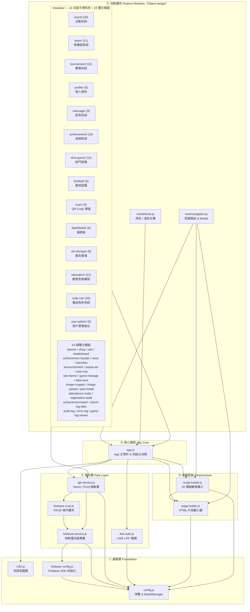
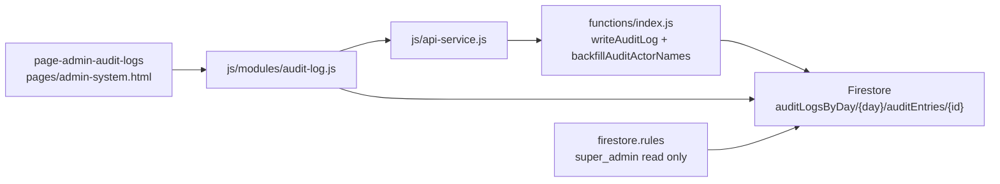

<!--
  結構文件交叉引用（任一檔案的結構描述更新時，必須同步更新以下所有檔案）：
  - docs/architecture.md       ← 本檔案（完整架構圖 + 模組清單 + Mermaid 圖）
  - docs/structure-guide.md    ← 中文功能導覽圖（給人看的，附功能解釋）
  - CLAUDE.md                  ← 目錄結構概覽（§ 目錄結構）
  - AGENTS.md                  ← 目錄結構指引（§ 目錄結構）
-->

# ToosterX — 模組架構圖

## 模組關係圖


```mermaid
flowchart TD
    subgraph F["① 基礎層 Foundation"]
        CONFIG["config.js\n常數 & ModeManager"]
        I18N["i18n.js\n多語系翻譯"]
        FB_CFG["firebase-config.js\nFirebase SDK 初始化"]
    end

    subgraph D["② 資料層 Data Layer"]
        FB_SVC["firebase-service.js\n快取優先服務層"]
        FB_CRUD["firebase-crud.js\nCRUD 操作擴充"]
        API["api-service.js\nDemo / Prod 抽象層"]
        LINE["line-auth.js\nLINE LIFF 驗證"]
    end

    subgraph I["③ 基礎設施 Infrastructure"]
        PAGE_LDR["page-loader.js\nHTML 片段載入器"]
        SCRPT_LDR["script-loader.js\nJS 模組動態載入"]
    end

    subgraph C["④ 核心應用 App Core"]
        APP["app.js\nApp 主物件 & 初始化流程"]
    end

    subgraph E["⑤ 功能擴充 Feature Modules（Object.assign）"]
        direction TB
        NAV["core/navigation.js\n頁面路由 & Modal"]
        THEME["core/theme.js\n深色 / 淺色主題"]

        subgraph MODS["modules/ — 14 功能子資料夾 + 24 獨立模組"]
            EVT["event/ (30)\n活動系統"]
            TEAM["team/ (11)\n俱樂部系統"]
            TOUR["tournament/ (12)\n賽事系統"]
            PROF["profile/ (9)\n個人資料"]
            MSG["message/ (9)\n訊息系統"]
            ACH["achievement/ (10)\n成就系統"]
            SHOT["shot-game/ (10)\n射門遊戲"]
            KICK["kickball/ (6)\n踢球遊戲"]
            SCAN["scan/ (5)\nQR Code 掃描"]
            DASH["dashboard/ (6)\n儀表板"]
            ADMG["ad-manage/ (6)\n廣告管理"]
            EDU["education/ (21)\n教育型俱樂部"]
            CCAT["color-cat/ (45)\n養成角色系統"]
            UADM["user-admin/ (5)\n用戶管理後台"]
            STANDALONE["24 個獨立模組\nbanner / shop / role / leaderboard\nachievement facade / news / favorites\nannouncement / popup-ad / auto-exp\nsite-theme / game-manage / data-sync\nimage-cropper / image-upload / pwa-install\nattendance-notify / registration-audit\nachievement-batch / admin-log-tabs\naudit-log / error-log / game-log-viewer"]
        end
    end

    %% Foundation 內部依賴
    FB_CFG --> CONFIG

    %% 資料層依賴
    FB_SVC --> CONFIG
    FB_SVC --> FB_CFG
    FB_CRUD --> FB_SVC
    API --> CONFIG
    API --> FB_SVC
    API --> FB_CRUD
    LINE --> CONFIG

    %% 基礎設施依賴
    PAGE_LDR --> CONFIG
    SCRPT_LDR --> CONFIG
    SCRPT_LDR --> PAGE_LDR

    %% App Core 依賴
    APP --> API
    APP --> LINE
    APP --> PAGE_LDR
    APP --> SCRPT_LDR
    APP --> I18N

    %% 功能擴充（Object.assign → App）
    NAV --> APP
    NAV --> PAGE_LDR
    NAV --> SCRPT_LDR
    THEME --> APP
    MODS --> APP
    MODS --> API
```

---

## 基礎層與核心模組說明

| 模組 | 說明 |
|------|------|
| `config.js` | 全域常數（`ROLES`、`TYPE_CONFIG`、`CACHE_VERSION` 等）；`ModeManager` 已硬編碼為 production |
| `i18n.js` | 多語系翻譯字串，無外部依賴，最先載入 |
| `firebase-config.js` | 初始化 Firebase SDK，向外暴露 `db`、`storage`、`auth` 全域物件 |
| `firebase-service.js` | **快取優先**資料層；以 `_cache` 記憶體物件映射 Firestore 子集合（`events/{docId}/registrations` 等），透過 `collectionGroup` 監聽器即時同步並持久化至 localStorage。提供 `_getEventDocId()` / `_getEventDocIdAsync()` 子集合路徑工具 |
| `firebase-crud.js` | 透過 `Object.assign` 擴充 `FirebaseService`，提供各集合的新增 / 更新 / 刪除 / 圖片上傳操作。包含 `_rebuildOccupancy()` 統一佔位重建函式，所有報名/取消/遞補流程共用 |
| `api-service.js` | **抽象層**；從 `FirebaseService._cache` 取資料，提供 `getRegistrationsByEvent()`、`getAttendanceRecords()` 等統一讀取介面 |
| `line-auth.js` | LINE LIFF SDK 封裝；在 Demo 模式或 localhost 時停用，提供登入 / 登出 / 取得個人資料 |
| `page-loader.js` | 按需非同步載入 `pages/*.html` 片段，快取版本由 `CACHE_VERSION` 控制。延遲載入（`_loadDeferred`）與按需載入（`ensurePage`）完成後自動呼叫 `App._bindPageElements()` 重新綁定事件 |
| `script-loader.js` | 定義頁面群組與模組映射；目前所有模組已在 `index.html` 以 `<script defer>` 靜態載入，ScriptLoader 作為保底機制確保頁面切換時模組可用 |
| `app.js` | `App` 主物件；定義 4 階段初始化流程、`renderAll()`、`showToast()`、`appConfirm()` |
| `core/navigation.js` | `showPage()` 策略分派頁面路由（stale-first / stale-confirm / prepare-first / fresh-first），Modal 管理、Drawer 開關，`_freshCheckBeforeAction()` 操作前確認，透過 `Object.assign` 擴充 App。策略由 `config.js` 的 `PAGE_STRATEGY` registry 定義 |
| `core/theme.js` | 深色 / 淺色主題切換，偏好儲存於 localStorage |

---

## Firestore 架構演進（2026-04-12 完成 Phase 4b）

### 子集合遷移完成狀態

`registrations`、`attendanceRecords`、`activityRecords` 三個集合已從根集合遷移至 `events/{docId}/` 子集合。完整計劃書見 `docs/stateful-imagining-dahl.md`。

| 項目 | 狀態 | 說明 |
|------|------|------|
| Phase 0-4b | ✅ 全部完成 | 索引 + rules + 雙寫 + 遷移 + 讀取切換 + 寫入翻轉 |
| Phase 4c | ⏸ 待執行 | 刪除根集合殘留資料 + 移除去重 + 鎖定 rules（不可逆，不影響功能） |

### 查詢路徑（已切換）

```
單一活動查詢：db.collection('events').doc(eventDocId).collection('registrations')
跨活動查詢：  db.collectionGroup('registrations') + 去重（doc.ref.parent.parent !== null）
CF 查詢：     admin.firestore().collectionGroup('registrations') + 去重（path.split('/').length > 2）
```

### 寫入路徑（已切換）

所有寫入只走子集合。根集合已凍結（無人讀寫），保留作為 Phase 4c 前的回退保險。

### 活動詳情頁局部更新機制（2026-04-13）

報名/取消/候補等操作後，活動詳情頁**不做全頁重繪**，改為局部 DOM 更新：
- `_refreshSignupButton()` — 按鈕狀態（含性別限定、球隊限定等 8 種分支）
- `_patchDetailCount()` — 人數文字更新
- `_patchDetailTables()` — 報名名單 + 候補名單 + 簽到表
- Firestore `onSnapshot` 觸發時也走局部更新路徑（`_debouncedSnapshotRender`）

---

## 功能子資料夾模組清單

### event/ — 活動系統（30 個模組）

| 檔案 | 說明 |
|------|------|
| `event-list-helpers.js` | 活動列表共用工具函式（建立者、俱樂部、性別、歸屬判斷） |
| `event-list-stats.js` | 活動列表統計渲染（徽章、日期解析、狀態、倒數計時） |
| `event-list-home.js` | 首頁活動區塊、運動捷徑、熱門活動渲染 |
| `event-list-timeline.js` | 時間軸卡片載入與活動列表渲染 |
| `event-list.js` | 活動列表主模組（整合上述 helper） |
| `event-share-builders.js` | 分享訊息建構工具（純函式，建構 Flex Message 內容） |
| `event-share.js` | 活動分享（LINE shareTargetPicker + 底部選單 + 建立後分享提示） |
| `event-detail.js` | 活動詳情頁主模組 |
| `event-detail-signup.js` | 活動報名 UI 入口（含 `handleSignup()`、`handleCancelSignup()`） |
| `event-detail-companion.js` | 同行者報名 UI（含 `_confirmCompanionRegister()`、`_confirmCompanionCancel()`） |
| `event-detail-calendar.js` | Google 日曆整合（一鍵加入行事曆、日期解析） |
| `event-detail-notify-prompt.js` | 報名後 LINE 通知綁定提示（可關閉，localStorage 記憶） |
| `event-create-input-history.js` | 建立活動表單輸入歷史（localStorage） |
| `event-create-sport-picker.js` | 建立活動運動標籤選擇器 |
| `event-create-delegates.js` | 建立活動代理人搜尋與管理 |
| `event-create-options.js` | 建立活動選項（費用、性別、報名開放時間） |
| `event-create-team-picker.js` | 建立活動俱樂部限定選擇器 |
| `event-create-external.js` | 建立外部活動工作流 |
| `event-create-template.js` | 建立活動範本管理（本地 + 雲端） |
| `event-create-multidate.js` | 多日期批次建立活動（單表單產生多場獨立活動） |
| `event-create-waitlist.js` | 建立活動候補自動遞補設定 |
| `event-create.js` | 建立活動主模組 |
| `event-manage-noshow.js` | 放鴿子統計（含鎖定函式 `_buildRawNoShowCountByUid()`、`_getNoShowDetailsByUid()`） |
| `event-manage-attendance.js` | 出席表格渲染與 helper |
| `event-manage-instant-save.js` | 即時儲存：checkbox 勾選後 300ms debounce 自動寫入 Firestore |
| `event-manage-confirm.js` | 批次確認出席（含鎖定函式 `_confirmAllAttendance()`），現主要處理備註 + 收尾 |
| `event-manage-lifecycle.js` | 活動 CRUD 操作（複製、刪除、狀態切換） |
| `event-manage-badges.js` | 活動管理徽章刷新 |
| `event-manage-waitlist.js` | 候補名單管理表格 |
| `event-manage.js` | 活動管理主模組（共用 helper） |
| `event-external-transit.js` | 外部活動中繼卡片（YouTube 嵌入、連結跳轉、分享） |

### team/ — 俱樂部系統（11 個模組）

| 檔案 | 說明 |
|------|------|
| `team-list.js` | 俱樂部列表主模組 |
| `team-list-render.js` | 俱樂部卡片渲染與列表顯示 |
| `team-detail.js` | 俱樂部詳情主模組 |
| `team-feed.js` | 俱樂部留言板 CRUD（subcollection：teams/{teamId}/feed） |
| `team-detail-render.js` | 俱樂部詳情渲染（活動、動態牆、留言） |
| `team-detail-members.js` | 俱樂部成員管理與邀請 |
| `team-share.js` | 俱樂部分享（LINE Flex Message + 底部選單） |
| `team-form-join.js` | 加入/退出俱樂部與角色變更 |
| `team-form-search.js` | 俱樂部表單搜尋 UI（隊長/副隊長/教練） |
| `team-form-init.js` | 俱樂部表單初始化與顯示 |
| `team-form.js` | 俱樂部表單主模組（建立/編輯） |

### tournament/ — 賽事系統（12 個模組 + README）

| 檔案 | 說明 |
|------|------|
| `README.md` | 賽事重構預留目錄說明 |
| `tournament-core.js` | 賽事共用核心 helper（狀態判斷、主辦顯示、友誼賽資料正規化） |
| `tournament-detail.js` | 賽事詳情頁主模組 |
| `tournament-render.js` | 公開賽事頁與詳情頁 renderer |
| `tournament-manage.js` | 賽事管理入口與管理列表權限過濾 |
| `tournament-manage-form.js` | 賽事表單工具與 helper（場地管理等） |
| `tournament-manage-host.js` | 賽事主辦俱樂部選擇與表單布局 |
| `tournament-manage-edit.js` | 賽事編輯 Modal 與儲存處理 |
| `tournament-share.js` | 賽事分享（LINE Flex Message） |
| `tournament-friendly-detail.js` | 友誼賽詳情頁（俱樂部申請、主辦審核、聯繫主辦人） |
| `tournament-friendly-detail-view.js` | 友誼賽詳情頁渲染（參加按鈕、俱樂部列表、待審列） |
| `tournament-friendly-roster.js` | 友誼賽 roster（球員名單、加入/退出、多隊身份選擇） |
| `tournament-friendly-notify.js` | 友誼賽通知（建賽、俱樂部申請、主辦審核推播） |

### profile/ — 個人資料（9 個模組）

| 檔案 | 說明 |
|------|------|
| `profile-avatar.js` | 頭像 helper（顯示、預設圖、快取） |
| `profile-core.js` | 個人資料核心 UI 與頁面入口 |
| `profile-form.js` | 個人資料編輯表單 |
| `profile-data.js` | 個人資料數據頁核心 |
| `profile-data-render.js` | 個人資料數據頁渲染 |
| `profile-data-stats.js` | 個人資料稱號與建議 |
| `profile-data-history.js` | 個人資料申請紀錄與同行者歷史 |
| `profile-card.js` | 個人名片彈窗 |
| `profile-share.js` | 個人名片 LINE Flex Message 分享（shareTargetPicker + 底部選單） |

### message/ — 訊息系統（9 個模組）

| 檔案 | 說明 |
|------|------|
| `message-render.js` | 訊息收件匣渲染與顯示 |
| `message-inbox.js` | 用戶收件匣與通知工具（slim glue） |
| `message-actions.js` | 收件匣操作（已讀、清除、賽事審核） |
| `message-actions-team.js` | 俱樂部加入申請審核操作 |
| `message-notify.js` | 通知範本與 LINE 推播 |
| `message-line-push.js` | LINE 推播通知佇列 |
| `message-admin-list.js` | 管理員站內信列表 |
| `message-admin-compose.js` | 管理員站內信撰寫 |
| `message-admin.js` | 管理員訊息主模組 |

### achievement/ — 成就系統（10 個模組）

| 檔案 | 說明 |
|------|------|
| `index.js` | 成就領域模組容器（registry / shared / stats / evaluator 的相容層入口） |
| `registry.js` | 成就條件 registry（action / timeRange、field state、legacy label fallback） |
| `shared.js` | 成就共用 helper（threshold、條件描述、分類排序等純函式） |
| `stats.js` | 成就衍生計算 helper（徽章數、已獲得徽章、稱號選項） |
| `evaluator.js` | 成就評估器（25 種動作類型、role_check、manual_award、只讀快照評估） |
| `badges.js` | 成就徽章 helper（同步/異步路徑、badge list HTML） |
| `titles.js` | 成就稱號 helper（稱號顯示、選項、提示、儲存） |
| `profile.js` | 成就個人頁 bridge（profile-facing API，供多模組共用） |
| `view.js` | 成就頁 view helper（公開成就頁卡片與徽章展示） |
| `admin.js` | 成就後台 helper（列表、表單、上傳、cleanup、手動授予面板） |

### shot-game/ — 射門遊戲（10 個模組）

| 檔案 | 說明 |
|------|------|
| `shot-physics.js` | 球體物理常數、工具函式、碰撞 helper |
| `shot-renderer.js` | Three.js 場景建構（場地線、球門、廣告看板） |
| `shot-scoring.js` | 分數對照表、連擊里程碑、訊息主題 helper |
| `shot-game-loop.js` | 遊戲迴圈、輸入處理、物理步進、計分 |
| `shot-game-engine.js` | 蓄力射門 3D 遊戲引擎（Three.js 主控） |
| `shot-lab-controls.js` | 實驗室資料 helper（排行榜處理、Mock 資料、身分驗證） |
| `shot-lab-ui.js` | 實驗室 UI 渲染（排行榜、排名圖示、格式化） |
| `shot-game-lab-page.js` | 蓄力射門實驗室頁面（token-gated，game-lab.html 專用） |
| `shot-page-ui.js` | 正式版頁面 UI（排行榜渲染、Session Badge、Intro/Modal） |
| `shot-game-page.js` | 蓄力射門正式版頁面（嵌入主站 game.html） |

### kickball/ — 踢球遊戲（6 個模組）

| 檔案 | 說明 |
|------|------|
| `kickball-helpers.js` | 踢球遊戲共用 helper |
| `kickball-leaderboard.js` | 踢球遊戲排行榜 |
| `kickball-renderer.js` | 踢球遊戲 Three.js 場景渲染 |
| `kickball-ui.js` | 踢球遊戲 UI 控制 |
| `kickball-physics.js` | 踢球遊戲物理引擎 |
| `kickball-game-page.js` | 開球王遊戲頁面（嵌入主站 kickball.html） |

### color-cat/ — 養成角色系統（45 個模組，含 dialogue/ 子目錄）

| 檔案 | 說明 |
|------|------|
| `color-cat-config.js` | 常數、皮膚定義（貓×2 + 兔×2）、動作定義 |
| `color-cat-stats.js` | 遊戲數值（體力、AI 權重、物理、粒子參數） |
| `color-cat-sprite.js` | 精靈圖載入、繪製、剪影、2x 高解析支援 |
| `color-cat-ball.js` | 球體物理、踢球煙塵、叼球模式 |
| `color-cat-character.js` | 角色核心（共享狀態、初始化、更新迴圈、公開 API） |
| `color-cat-character-stamina.js` | 體力消耗/恢復、虛弱等級觸發、體力條繪製 |
| `color-cat-character-particles.js` | 跑步煙塵、擊退爆發、呼吸動畫、愛心粒子 |
| `color-cat-character-actions.js` | 動作啟動/停止、移動更新（追球、走向紙箱、短跑） |
| `color-cat-character-actions-interact.js` | 互動動作：睡覺、醒來、賞花、攻擊花/草/蝴蝶/敵人 |
| `color-cat-character-actions-special.js` | 特殊動作：必殺蓄力+釋放、擊退恢復、逃跑、喘氣返回 |
| `color-cat-character-combo.js` | 連續動作序列（爬邊牆、爬紙箱、咬球跑） |
| `color-cat-character-combat.js` | 戰鬥邏輯：受傷、瀕死倒數→重生、攻擊敵人、敵人 AI 互動 |
| `color-cat-character-bubble.js` | 對話氣泡：依情緒×MBTI×皮膚取得台詞並顯示 |
| `color-cat-character-ai.js` | AI 行為選擇（權重+MBTI+環境修正）、追球/踢球/閒置更新 |
| `color-cat-mbti.js` | MBTI 16 型人格系統：對應行動權重乘數 |
| `color-cat-damage-number.js` | 浮動傷害/經驗值數字（生成、上浮、淡出） |
| `color-cat-enemy.js` | 敵人系統：10 種敵人×4 技能、生成、狀態機、AI 行為樹、精英 |
| `color-cat-enemy-draw.js` | 敵人精靈渲染：幀推進、陰影、傷害數字、受驚效果 |
| `color-cat-enemy-projectile.js` | 投射物系統：弓箭/魔法彈生成、物理更新、碰撞偵測 |
| `color-cat-enemy-util.js` | 戰鬥工具：命中偵測、傷害套用、擊退軌跡、搜尋最近敵人 |
| `color-cat-profile.js` | 角色資訊（名稱、等級、數值、個性、心情、裝備） |
| `color-cat-scene.js` | 場景核心（共享狀態、主迴圈、初始化、點擊、App 掛載） |
| `color-cat-scene-bg.js` | 背景繪製（天空漸層、山丘、雲朵、日夜循環） |
| `color-cat-scene-box.js` | 紙箱繪製（箱體、貓臉塗鴉、蓋子開合、Zzz） |
| `color-cat-scene-flag.js` | 旗子繪製（飄揚動畫、旗上貓臉）+ 牆面影子 |
| `color-cat-scene-flower.js` | 花朵系統（4 階段成長、金花 1/6 機率、採集 EXP、枯萎） |
| `color-cat-scene-grass.js` | 雜草系統（自動生長、離線補長、鋤草動畫、存檔） |
| `color-cat-scene-butterfly.js` | 蝴蝶系統（懸停物理、隨機行走、玩家追逐觸發） |
| `color-cat-scene-fog.js` | 濃霧事件（降低能見度、嚇退敵人 90% 休眠、視覺覆蓋） |
| `color-cat-scene-grave.js` | 死亡墓碑（死亡位置生成、累積、點擊摧毀） |
| `color-cat-scene-panel.js` | 右側抽屜面板（框架、把手、側邊頁籤、碰撞檢測） |
| `color-cat-scene-panel-tab0.js` | 面板頁籤0：基本資料（頭像、名稱、等級、EXP、換膚） |
| `color-cat-scene-panel-tab1.js` | 面板頁籤1：狀態（體力條、HP 條、虛弱顯示） |
| `color-cat-scene-panel-tab2.js` | 面板頁籤2：裝備（6 格裝備欄位，預留擴充） |
| `color-cat-scene-panel-modal.js` | 浮動統計 Modal（角色檔案、成就列表、數值明細） |
| `color-cat-scene-signpost-modal.js` | 故事/提示 Modal（首次載入說明遊戲機制） |
| `color-cat-scene-stats-modal.js` | 詳細數值 Modal（體力狀態、動作歷史、戰鬥統計、MBTI） |
| `color-cat-scene-weather.js` | 天氣系統（晴/陰/雨/雷暴/雪/霧 + 粒子特效） |
| `color-cat-naming.js` | 角色命名 UI overlay（LINE 暱稱帶入 + 自訂） |
| `color-cat-cloud-save.js` | Firestore 雲端存讀檔 + localStorage 備援 + dirty flag |
| **dialogue/ 子目錄** | |
| `dialogue/color-cat-dialogue-data.js` | 基礎對話池：4 皮膚×4 情緒×10 台詞 |
| `dialogue/color-cat-dialogue-mbti-analysts.js` | INTJ/INTP/ENTJ/ENTP 分析師型台詞 |
| `dialogue/color-cat-dialogue-mbti-diplomats.js` | INFJ/INFP/ENFJ/ENFP 外交官型台詞 |
| `dialogue/color-cat-dialogue-mbti-explorers.js` | ISTP/ISFP/ESTP/ESFP 探險家型台詞 |
| `dialogue/color-cat-dialogue-mbti-sentinels.js` | ISTJ/ISFJ/ESTJ/ESFJ 守衛者型台詞 |

### scan/ — QR Code 掃描（5 個模組）

| 檔案 | 說明 |
|------|------|
| `scan.js` | QR Code 掃描簽到/簽退主模組 |
| `scan-ui.js` | 掃描頁 UI 渲染（活動分類、選擇器、出席區塊） |
| `scan-camera.js` | 相機初始化、QR 掃描、裝置選擇、手動 UID 輸入 |
| `scan-process.js` | 掃描結果處理、出席標記、驗證 |
| `scan-family.js` | 家庭成員批次簽到 Modal |

### dashboard/ — 儀表板（6 個模組）

| 檔案 | 說明 |
|------|------|
| `dashboard-widgets.js` | 儀表板 Canvas 圖表元件與 helper |
| `dashboard.js` | 管理員後台數據儀表板 |
| `dashboard-participant-query.js` | 活動參與查詢摘要卡（關鍵字、日期區間、摘要、臨時頁入口） |
| `dashboard-participant-share.js` | 活動參與查詢臨時報表分享（7 天有效網址與公開快照頁） |
| `dashboard-usage.js` | 雲端用量指標（Firestore/Functions 用量、免費額度百分比、7 天趨勢圖） |
| `personal-dashboard.js` | 個人數據儀表板（參加場次、出席率、EXP 統計） |

### education/ — 教育型俱樂部（21 個模組）

| 檔案 | 說明 |
|------|------|
| `edu-helpers.js` | 共用工具：isEducationClub、權限、年齡計算、generateWeeklyDates |
| `edu-group-list.js` | 分組列表渲染 |
| `edu-group-form.js` | 分組 CRUD 表單 |
| `edu-student-list.js` | 學員列表、分組內學員卡片 |
| `edu-student-form.js` | 學員資料表單（新增/編輯/自動歸組） |
| `edu-student-join.js` | 學員/家長申請加入 + 教練審核 |
| `edu-detail-render.js` | 教育型俱樂部詳情頁渲染（框架 + 頁籤 + 成員區塊） |
| `edu-detail-realtime.js` | Firestore 即時監聽（students / teams） |
| `edu-detail-withdraw.js` | 退學 / 取消申請流程 |
| `edu-course-plan.js` | 課程方案 CRUD（週期制 + 堂數制） |
| `edu-course-plan-render.js` | 課程方案卡片渲染（排序、置頂、報名按鈕） |
| `edu-course-plan-attendance.js` | 課程出勤月曆彈窗（按日期顯示出勤明細） |
| `edu-course-enrollment.js` | 課程報名申請、教練審核、備註、繳費旗標 |
| `edu-course-enrollment-render.js` | 報名名冊渲染（待審/已核准頁籤、繳費追蹤） |
| `edu-checkin.js` | 群組批次簽到 |
| `edu-checkin-scan.js` | QR 掃碼簽到（掃到自動歸組） |
| `edu-calendar-core.js` | 行事曆共用邏輯、視圖切換 |
| `edu-calendar-stamp.js` | 集點卡視圖 |
| `edu-calendar-monthly.js` | 月曆格子視圖 |
| `edu-parent-binding.js` | 家長-孩子綁定管理 |
| `edu-notify.js` | 通知：簽到成功、課前提醒、出席報告 |

### ad-manage/ — 廣告管理（6 個模組）

| 檔案 | 說明 |
|------|------|
| `ad-manage-core.js` | 廣告管理核心（共用 helper） |
| `ad-manage-banner.js` | Banner 輪播廣告管理 |
| `ad-manage-float.js` | 浮動廣告管理 |
| `ad-manage-popup-sponsor.js` | 贊助彈窗廣告管理 |
| `ad-manage-shotgame.js` | 小遊戲廣告管理 |
| `boot-brand-manage.js` | 品牌開機動畫管理 |

### user-admin/ — 用戶管理後台（5 個模組）

| 檔案 | 說明 |
|------|------|
| `user-admin-list.js` | 用戶列表與搜尋 |
| `user-admin-exp.js` | 用戶 EXP 管理 |
| `user-admin-roles.js` | 角色權限管理（自訂層級、權限面板、儲存預設） |
| `user-admin-perm-info.js` | 權限說明彈窗（每個權限開關旁的「?」按鈕與說明內容） |
| `user-admin-corrections.js` | 用戶補正管理 |

---

## 獨立模組清單（24 個）

以下模組位於 `js/modules/` 根目錄，不屬於任何子資料夾：

| 檔案 | 說明 |
|------|------|
| `achievement.js` | 成就領域 facade（保留舊入口方法名稱，逐步轉接到 `achievement/` 子模組） |
| `achievement-batch.js` | 成就批次更新（一鍵為全員重新計算成就進度） |
| `admin-log-tabs.js` | 管理員日誌中心（操作日誌 + 審計日誌 + 錯誤日誌頁籤介面） |
| `announcement.js` | 系統公告管理與顯示 |
| `attendance-notify.js` | 被掃方即時通知（Production: Firestore onSnapshot / Demo: 直接觸發） |
| `audit-log.js` | `super_admin` 審計日誌查詢（單日查詢、時間/UID/動作篩選） |
| `auto-exp.js` | 自動 EXP 規則設定（依行為觸發） |
| `auto-exp-rules.js` | 自動 EXP 對帳規則（放鴿子扣分 / LINE 綁定獎勵 / 徽章獎勵，reconciliation model） |
| `banner.js` | 首頁輪播 Banner 渲染 |
| `data-sync.js` | 系統資料同步（俱樂部成員數重算、用戶俱樂部欄位驗證、孤兒記錄清理），含費用預估 |
| `error-log.js` | 錯誤日誌查詢與嚴重度分類顯示 |
| `favorites.js` | 用戶收藏活動 / 俱樂部管理 |
| `game-log-viewer.js` | 遊戲歷史紀錄瀏覽器（篩選遊戲/日期、分頁、統計） |
| `game-manage.js` | 小遊戲管理（首頁顯示開關，預留多款遊戲設定） |
| `image-cropper.js` | 圖片裁切 Modal（拖拽定位 + 縮放 + Canvas 輸出） |
| `image-upload.js` | 圖片上傳共用功能（Firebase Storage），整合 image-cropper 裁切 |
| `leaderboard.js` | 用戶 EXP 排行榜 |
| `news.js` | 首頁每日體育新聞渲染（卡片直瀑式），資料來自 Cloud Function 定時抓取 |
| `popup-ad.js` | 首頁彈窗廣告顯示邏輯 |
| `pwa-install.js` | PWA 安裝提示（Android/iOS 偵測、beforeinstallprompt、引導安裝） |
| `registration-audit.js` | 報名資料審計與修復（`auditRegistrations()` 掃描差異、`repairRegistrations()` 回寫修正） |
| `role.js` | 角色系統、抽屜選單渲染、自訂層級 runtime 等級計算、後台入口權限判斷 |
| `shop.js` | 二手運動商品市集（刊登、購買、管理） |
| `site-theme.js` | 站點佈景主題設定（管理端） |

---

## 初始化流程（4 階段 + 延遲載入回呼）

```
DOMContentLoaded
  │
  ├─ Phase 1（非阻塞）── PageLoader.loadAll()     → 載入 Boot HTML 片段（home / activity / team / profile / message）
  │                        └─ 排程 _loadDeferred() → 背景載入延遲頁面（scan / tournament / shop / game / admin-* / personal-dashboard）
  │
  ├─ Phase 2 ── FirebaseService._restoreCache()   → 從 localStorage 還原快取（Prod 模式）
  ├─ Phase 3 ── App.init() → renderAll()          → 立即顯示 UI（使用快取或 Demo 資料）
  │                └─ 隱藏 Loading 遮罩
  │
  ├─ Phase 1 完成 → App.renderAll() + App._bindPageElements()  → 補跑一次渲染與事件綁定
  │
  ├─ _loadDeferred() 完成 → App._bindPageElements()  → 延遲頁面元素事件綁定（如廣告圖片上傳）
  │
  └─ Phase 4（背景 async — 分層啟動）
       ├─ 載入 Firebase + LIFF CDN SDK
       ├─ FirebaseService.init()（分層啟動）
       │    ├─ 立即：boot collections (.get()) + events/teams listeners（公開讀取，不等 Auth）
       │    ├─ 並行：Auth（LINE Custom Token / 匿名）
       │    ├─ init 完成 → 首頁可渲染
       │    ├─ 背景：terminal events listener（公開，非首頁必需）
       │    └─ Auth 完成後：messages + users + rolePermissions listeners → seed
       ├─ LineAuth.init()                          → LINE 登入狀態初始化
       └─ 延遲 listener（進入頁面時）：registrations / attendanceRecords
```

> Phase 3 在 Phase 1/4 之前完成渲染，確保弱網路環境下不出現白畫面。
> Phase 4 的分層啟動讓公開資料（boot + events + teams）不等 Auth 直接載入，大幅減少冷啟動時間。
> 延遲載入的頁面（admin-content 等）在 DOM 注入後會觸發 `_bindPageElements()` 重新綁定事件。

## Script 載入順序（index.html defer 順序）

```
i18n.js → config.js → firebase-config.js
  → firebase-service.js → firebase-crud.js → api-service.js → line-auth.js
  → page-loader.js → script-loader.js → app.js
  → core/navigation.js → core/theme.js
  → [boot modules 以 <script defer> 靜態載入，其餘由 ScriptLoader 按需載入]
```

## ScriptLoader 群組定義

ScriptLoader（`js/core/script-loader.js`）定義了以下頁面群組，按需動態載入：

| 群組名稱 | 載入模組 | 觸發頁面 |
|----------|----------|----------|
| `achievement` | `image-cropper` + `image-upload` + `achievement/*` (10) + `achievement.js` | 成就頁、個人資料、排行榜 |
| `activity` | `event/*` (27) + `registration-audit.js` | 活動列表、詳情、我的活動 |
| `team` | `event/event-share-builders` + `event/event-share` + `team/*` (10) | 俱樂部列表、詳情、管理 |
| `profile` | `event/event-share-builders` + `event/event-share` + `profile/*` (9) | 個人資料、名片、稱號 |
| `shop` | `shop.js` + `leaderboard.js` | 商城、排行榜 |
| `scan` | `scan/*` (5) + `attendance-notify.js` | QR Code 掃描 |
| `game` | `shot-game/shot-page-ui` + `shot-game/shot-game-page` | 射門遊戲 |
| `kickball` | `kickball/*` (6) | 踢球遊戲 |
| `tournamentAdmin` | `event/event-share-*` + `tournament/tournament-manage-*` + `tournament-share` | 賽事管理 |
| `messageAdmin` | `message/message-admin-*` (3) | 管理員訊息 |
| `adminDashboard` | `dashboard/*` (5，不含 personal-dashboard) | 管理員儀表板 |
| `personalDashboard` | `dashboard/dashboard-widgets` + `dashboard/dashboard` + `dashboard/personal-dashboard` | 個人儀表板 |
| `adminUsers` | `user-admin/*` (5) + `achievement-batch` + `data-sync` | 用戶管理 |
| `education` | `education/*` (21) | 教育型俱樂部（分組、學員、課程、報名、簽到、行事曆） |
| `adminContent` | `ad-manage/*` (6) | 廣告管理 |
| `adminSystem` | `auto-exp` + `game-manage` + `admin-log-tabs` + `error-log` + `audit-log` | 系統管理 |

---

## 3D Charged Shot Lab (Phase 0, private route)

- 入口頁面：`game-lab.html`（不在主站導航中；token-gated）
- Runtime 模組：
  - `js/modules/shot-game/shot-physics.js`
  - `js/modules/shot-game/shot-renderer.js`
  - `js/modules/shot-game/shot-scoring.js`
  - `js/modules/shot-game/shot-game-loop.js`
  - `js/modules/shot-game/shot-game-engine.js`
  - `js/modules/shot-game/shot-lab-controls.js`
  - `js/modules/shot-game/shot-lab-ui.js`
  - `js/modules/shot-game/shot-game-lab-page.js`
- 外部依賴：
  - `three.js r128` via CDN in `game-lab.html`
- 資料流（Phase 0）：
  1. `ShotGameLabPage` 驗證 query token（`?t=`）對照 SHA-256 hash
  2. 成功後，`ShotGameEngine` 初始化並運行於 `#shot-game-container`
  3. 遊戲結束時，本地數據寫入 localStorage key `sporthub_shot_game_lab_metrics_v1`
  4. 測試面板渲染摘要並支援 JSON 匯出/重置
- 隔離邊界：
  - Phase 0 無 Firestore 讀寫
  - 尚未使用 `Object.assign(App, ...)` 掛載

---

## Audit Log Additions (2026-03-09)

- New Cloud Functions: `functions/index.js` exports `writeAuditLog` and `backfillAuditActorNames`
  - Trusted write path for audit events
  - Adds `dayKey`, `timeKey`, `actorUid`, `actorRole`, `createdAt`, `expiresAt`
  - Writes to `auditLogsByDay/{yyyyMMdd}/auditEntries/{logId}`
- Frontend module: `js/modules/audit-log.js`
  - `super_admin` single-day audit log page
  - Local filters for time range, nickname or UID, and action
  - No realtime listener and no localStorage persistence
- Admin route:
  - `page-admin-audit-logs`
  - Fragment source: `pages/admin-system.html`
  - Lazy script group: `adminSystem`


```mermaid
flowchart LR
    UI["page-admin-audit-logs\npages/admin-system.html"]
    MOD["js/modules/audit-log.js"]
    API["js/api-service.js"]
    CF["functions/index.js\nwriteAuditLog + backfillAuditActorNames"]
    FS["Firestore\nauditLogsByDay/{day}/auditEntries/{id}"]
    RULES["firestore.rules\nsuper_admin read only"]

    UI --> MOD
    MOD --> API
    API --> CF
    CF --> FS
    MOD --> FS
    RULES --> FS
```

## UID Migration Cloud Function (2026-03-17)

- New Cloud Function: `functions/index.js` exports `migrateUidFields`
  - `onCall`, requires `super_admin` role
  - Fixes historical `attendanceRecords`/`activityRecords` where `uid` field contains displayName instead of LINE userId
  - Supports `dryRun` mode for preview, automatic backup to `_migrationBackups` collection
  - Handles duplicate names via cross-referencing `registrations` collection
  - Region: `asia-east1`, timeout: 540s, memory: 512MiB
- Frontend trigger: `js/modules/data-sync.js` — `_syncUidMigration()` operation
  - UI button in `pages/admin-system.html` ("⑤ UID 欄位修正")
  - Follows existing dry-run + confirm + progress pattern

## Admin Log Center Update (2026-03-10)

- Frontend module: `js/modules/admin-log-tabs.js`
  - Merges operation logs, audit logs, and error logs into the single route `page-admin-logs`
  - Builds tabbed panels at runtime from `pages/admin-system.html`
  - Keeps legacy routes `page-admin-audit-logs` and `page-admin-error-logs` as aliases that redirect to the same page with the matching tab
- Updated route dependencies:
  - `page-admin-logs` now lazy-loads both `adminUsers` and `adminSystem`
  - `page-admin-logs` now preloads both `operationLogs` and `errorLogs`
- UI behavior:
  - Left drawer now exposes one entry only: log center
  - Inside the page, tabs switch between operation, audit, and error logs without leaving the route

## Admin Drawer Permission Update (2026-03-10)

- `js/config.js`
  - 新增後台抽屜入口對應的權限碼定義（例如 `admin.dashboard.entry`、`admin.games.entry`）
  - 內建權限分類改以抽屜入口名稱為分類標題，且每個分類至少包含「顯示入口」
  - 權限分類排序直接沿用抽屜順序，包含「活動管理」與「賽事管理」入口
  - 內建角色 / 自訂角色的 runtime 等級與顏色資訊改由動態序列計算，不再只靠固定 `ROLE_LEVEL_MAP`
- `js/modules/role.js`
  - 只要抽屜入口有 `permissionCode`，就改由權限碼單獨控制顯示與進頁，不再受 `minRole` 限制
  - `showPage()` 與頁面根節點顯示共用同一套頁面權限判斷，避免手動切頁繞過抽屜隱藏
- `js/modules/user-admin/user-admin-roles.js`
  - 自訂層級列表排序改用 runtime 序列，支援「自訂層級插在自訂層級之後」
  - 權限面板改由內建 catalog + Firestore `permissions` 合併渲染
  - 新增「儲存成預設」與「只顯示已有權限」操作，並把 `rolePermissions.defaultPermissions` 作為各層級重置來源
  - `super_admin` 權限開關在 UI 層固定鎖定，避免誤觸關閉抽屜入口或其他權限
- `js/firebase-service.js`
  - `rolePermissions` 即時監聽新增 catalog metadata，並同步讀取 `defaultPermissions`
  - `super_admin` 登入時會做一次後台入口權限補遷移，避免舊的 admin / super_admin 在新入口權限上線後瞬間失去抽屜入口

## Participant Query Temporary Share (2026-03-10)

- Frontend module: `js/modules/dashboard/dashboard-participant-share.js`
  - Adds the dashboard action that snapshots participant-query results into a short-lived share report
  - Renders the public route `page-temp-participant-report` from `?rid=<shareId>#page-temp-participant-report`
- New data model:
  - `participantQueryShares/{shareId}`
  - `participantQueryShares/{shareId}/shareItems/{itemId}`
- Access model:
  - Only `admin / super_admin` can create report snapshots
  - Anyone with the URL can read a ready, unexpired snapshot
  - Public page hides `UID` and only exposes display name, count, recent date, and matched events
- Lifecycle:
  - Reports are query-time snapshots, not live reruns
  - Each snapshot carries `expiresAt` and is intended to expire after 7 days

## Realtime Scope Update (2026-03-09)

- `events` and `teams` are no longer boot-time global realtime listeners.
- Homepage, teams, and tournament pages now rely on static `.get()` loads through `FirebaseService.ensureCollectionsForPage()`.
- True page-scoped realtime is kept only for activity-sensitive pages:
  - `page-activities`
  - `page-activity-detail`
  - `page-my-activities`
  - `page-scan`
- The page-scoped realtime collections are:
  - `registrations`
  - `attendanceRecords`
- `js/core/navigation.js` now finalizes page-scoped listeners on route changes so activity listeners do not stay subscribed after leaving those pages.

## Audit / Error Log Display Update (2026-03-09)

- Audit logs now resolve display names with two layers:
  - Cloud Function `writeAuditLog` prefers `users.uid`, user profile name, and Firebase Auth `displayName`
  - Admin audit log UI locally falls back to `adminUsers` cache when old entries only stored `actorUid`
- Super admin can trigger `backfillAuditActorNames` for a selected audit day to write missing `actorName` values back into `auditLogsByDay/{day}/auditEntries/{id}`.
- Error log UI now translates common Firebase / network errors into Chinese at render time and derives a severity badge:
  - `嚴重`
  - `警告`
  - `一般`
- The Chinese translation and severity are display-layer derived, so existing historical `errorLogs` entries benefit without Firestore migration.

## Users Self-Update Security Boundary (2026-03-09)

- `users/{userId}` 的自助更新責任已拆成三條規則路徑：
  - 一般個人資料更新：`isSafeSelfProfileUpdate`
  - 登入更新格式：`isSafeLoginUpdate`
  - 俱樂部欄位退出流程：`isTeamFieldShrinkOrClear`
- 最後登入時間（`lastLogin`）不再允許夾帶於一般個人資料更新；只接受登入更新格式，且值必須等於 `request.time`。
- 更新時間（`updatedAt`）在自助更新與隊職員跨使用者俱樂部調整中，皆改為只接受 `request.time`，避免客戶端偽造任意 Timestamp。
- 俱樂部欄位（`teamId`、`teamName`、`teamIds`、`teamNames`）已自一般個人資料白名單移除：
  - 一般使用者不可自行填入新俱樂部歸屬
  - 一般使用者只能全清或把既有 `teamIds` 縮減為嚴格子集
- 前端的退出俱樂部（`handleLeaveTeam`）沿用既有多俱樂部 shrink 邏輯；刪除俱樂部（`deleteTeam`）則補上 secondary team 清理，避免只清主俱樂部造成殘留引用。

---

## 報名系統鎖定函式路徑

| 鎖定函式 | 檔案路徑 |
|----------|----------|
| `registerForEvent()` | `js/firebase-crud.js` |
| `batchRegisterForEvent()` | `js/firebase-crud.js` |
| `cancelRegistration()` | `js/firebase-crud.js` |
| `cancelCompanionRegistrations()` | `js/firebase-crud.js` |
| `_rebuildOccupancy()` | `js/firebase-crud.js` |
| `_applyRebuildOccupancy()` | `js/firebase-crud.js` |
| `handleSignup()` | `js/modules/event/event-detail-signup.js` |
| `handleCancelSignup()` | `js/modules/event/event-detail-signup.js` |
| `_confirmCompanionRegister()` | `js/modules/event/event-detail-companion.js` |
| `_confirmCompanionCancel()` | `js/modules/event/event-detail-companion.js` |

## 統計系統鎖定函式路徑

| 鎖定函式 | 檔案路徑 |
|----------|----------|
| `_buildRawNoShowCountByUid()` | `js/modules/event/event-manage-noshow.js` |
| `_getNoShowDetailsByUid()` | `js/modules/event/event-manage-noshow.js` |
| `_confirmAllAttendance()` | `js/modules/event/event-manage-confirm.js` |
| `getParticipantAttendanceStats()` | `js/modules/achievement/stats.js` |
| `_calcScanStats()` | `js/modules/leaderboard.js` |
| `_categorizeRecords()` | `js/modules/leaderboard.js` |
| `ensureUserStatsLoaded()` | `js/firebase-service.js` |
| `getUserAttendanceRecords()` | `js/api-service.js` |

---

## 結構文件同步規則

當任何模組被新增、搬移或刪除時，**必須同步更新以下所有檔案**：

### 需同步更新的檔案與區段

| 檔案 | 需更新的區段 | 說明 |
|------|-------------|------|
| `docs/architecture.md` | Mermaid 圖 MODS 子圖 + 功能子資料夾模組清單 + 獨立模組清單 + ScriptLoader 群組表 + 鎖定函式路徑表 | 完整架構圖與模組清單 |
| `docs/structure-guide.md` | 中文功能導覽圖 | 給人看的功能導覽（附功能解釋） |
| `CLAUDE.md` | `§ 目錄結構（概覽）` | 目錄樹與模組數量 |
| `AGENTS.md` | `§ 目錄結構指引` | Agent 用目錄結構指引 |

### 同步規則

1. **新增模組**：在上述四個檔案中加入新模組的路徑與說明
2. **搬移模組**：更新所有出現舊路徑的地方為新路徑（包含鎖定函式路徑表）
3. **刪除模組**：從所有檔案中移除對應條目
4. **子資料夾新增/合併**：更新 Mermaid 圖的 MODS 子圖、模組清單表、ScriptLoader 群組表
5. **ScriptLoader 群組變更**：同步更新 `js/core/script-loader.js` 的 `_groups` 定義與本文件的群組表
