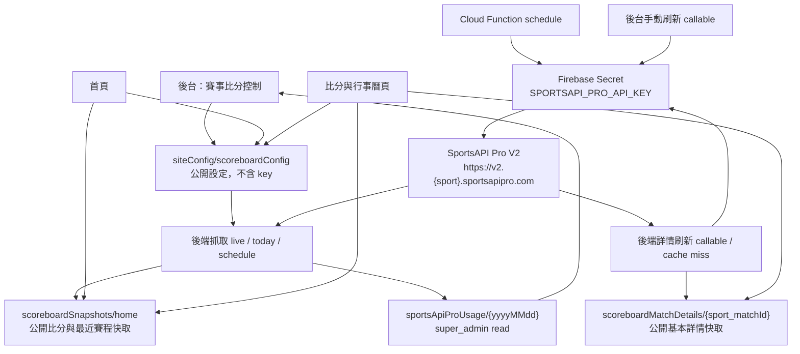

# SportsAPI Pro Scoreboard Integration Plan

> 建立日期：2026-05-06  
> 狀態：待實作  
> 重要安全原則：API key 只放 Firebase Functions Secret，不寫入前端、不寫入 Firestore 公開文件、不寫入本計劃書、不寫入 log。

## 目標

把 SportsAPI Pro 接入 ToosterX，先完成可用的「即時比分 + 最近賽程 + 運動橫向頁籤 + 基本詳情」，再補齊後台控制、用量儀表與部署驗收。

本次核心需求：

1. 首要功能是即時比分與最近賽程。
2. 比分 / 賽程頁要有橫向切換運動頁籤，頁籤以 SportsAPI Pro V2 已支援 sport 為準。
3. 點擊比賽資訊可查看更詳細的基本內容，內容以 API 有提供且適合公開顯示為準。
4. 左側抽屜入口「賽事比分控制」要更新排版、來源開關、排序、刷新、用量儀表。
5. SportsAPI Pro 官方已支援的 sport，後台都要有可控開關；首頁預設顯示可再由開關控制。
6. 全面盡可能補自動化測試：rules、unit、normalizer、render、權限、用量安全。
7. 首頁載入速度優先；前端不直接呼叫 SportsAPI Pro。

## 官方文件已確認事項

來源：

- https://docs.sportsapipro.com/
- https://docs.sportsapipro.com/authentication
- https://docs.sportsapipro.com/quickstart
- https://docs.sportsapipro.com/api-reference/overview
- https://docs.sportsapipro.com/api-reference/football-v2/overview
- https://docs.sportsapipro.com/api-reference/badminton-v2/overview

已確認：

- 官方服務名稱是 `SportsAPI Pro`。
- V2 是官方建議的一般用途版本，支援 25+ sports；V3 支援更廣但 cache 較長，V1 是 legacy / faster score update。
- V2 Base URL 型態是 `https://v2.{sport}.sportsapipro.com`。
- 所有版本都使用 `x-api-key` header。
- 官方明確要求 API key server-side only，不得放 client-side JavaScript。
- 官方 common V2 endpoint pattern：
  - `GET /api/live`
  - `GET /api/today`
  - `GET /api/schedule/{date}`
  - `GET /api/search?q={query}`
  - `GET /api/countries`
  - `GET /api/match/{id}`
  - `GET /api/match/{id}/statistics`
  - `GET /api/match/{id}/lineups`
  - `GET /api/match/{id}/incidents`
  - `GET /api/tournament/{id}/info`
  - `GET /status`
- 官方文件特別說明：V2 endpoints 用 `/api/live`，不是 `/api/football/live`；sport 由 subdomain 決定。
- `/status` 回傳 account 與 usage，例如 `daily_limit`、`remaining`、`requests_today`、`reset_at`。
- rate limit headers 可能包含：
  - `X-RateLimit-Limit`
  - `X-RateLimit-Remaining`
  - `X-RateLimit-Reset`
- V2 回應不完全同形：
  - Football `/api/live` 可能是 root `events`，team / score 可能是 flat string / number。
  - Basketball / Baseball score 可能是物件，含 `current`、`display`、period / innings。
  - Tennis 文件範例是 `data.events`，score 含 `point`、period set data。
  - Badminton V2 已確認存在，Base URL 是 `https://v2.badminton.sportsapipro.com`，支援 `/api/live`，score fields 為 `period1` 至 `period3`。

上一版早期計劃曾誤引用 `SportsDataAPI`。本計劃已改為 `SportsAPI Pro` 官方文件、base URL 與 endpoint。

## API 支援 sport 清單與 ToosterX 開關策略

後台「賽事比分控制」要建立完整 SportsAPI Pro V2 sport catalog。已讀官方 sport IDs reference 中確認可用：

| Sport key | 後台顯示 | SportsAPI Pro V2 base URL | 初始狀態 |
|---|---|---|---|
| `football` | 足球 | `https://v2.football.sportsapipro.com` | 預設開 |
| `basketball` | 籃球 / NBA | `https://v2.basketball.sportsapipro.com` | 預設開 |
| `tennis` | 網球 | `https://v2.tennis.sportsapipro.com` | 預設開 |
| `baseball` | 棒壘球 | `https://v2.baseball.sportsapipro.com` | 預設開 |
| `badminton` | 羽球 | `https://v2.badminton.sportsapipro.com` | 預設開 |
| `ice_hockey` | 冰球 | `https://v2.ice-hockey.sportsapipro.com` | 預設關 |
| `handball` | 手球 | `https://v2.handball.sportsapipro.com` | 預設關 |
| `american_football` | 美式足球 | `https://v2.american-football.sportsapipro.com` | 預設關 |
| `volleyball` | 排球 | `https://v2.volleyball.sportsapipro.com` | 預設關 |
| `cycling` | 自行車 | `https://v2.cycling.sportsapipro.com` | 預設關 |
| `motorsport` | 賽車 | `https://v2.motorsport.sportsapipro.com` | 預設關 |
| `rugby` | 橄欖球 | `https://v2.rugby.sportsapipro.com` | 預設關 |
| `table_tennis` | 桌球 | `https://v2.table-tennis.sportsapipro.com` | 預設關 |
| `snooker` | 撞球 / 司諾克 | `https://v2.snooker.sportsapipro.com` | 預設關 |
| `darts` | 飛鏢 | `https://v2.darts.sportsapipro.com` | 預設關 |
| `water_polo` | 水球 | `https://v2.water-polo.sportsapipro.com` | 預設關 |
| `futsal` | 五人制足球 | `https://v2.futsal.sportsapipro.com` | 預設關 |
| `bandy` | 班迪球 | `https://v2.bandy.sportsapipro.com` | 預設關 |
| `beach_volleyball` | 沙灘排球 | `https://v2.beach-volleyball.sportsapipro.com` | 預設關 |
| `cricket` | 板球 | `https://v2.cricket.sportsapipro.com` | 預設關 |
| `minifootball` | 小型足球 | `https://v2.minifootball.sportsapipro.com` | 預設關 |
| `aussie_rules` | 澳洲式足球 | `https://v2.aussie-rules.sportsapipro.com` | 預設關 |
| `esports` | 電競 | `https://v2.esports.sportsapipro.com` | 預設關 |
| `floorball` | 福樂球 | `https://v2.floorball.sportsapipro.com` | 預設關 |
| `mma` | 綜合格鬥 | `https://v2.mma.sportsapipro.com` | 預設關 |

說明：

- 官方清單未確認的匹克球、高爾夫先不假接，後台可放「未支援 / 預留」區，不進入自動抓取。
- 預設開啟只放 ToosterX 使用者最可能需要的 sport，避免免費方案 100 requests/day 被快速耗盡。
- 後台仍要能看到所有 API 已支援 sport 的開關，管理者可自行開啟。
- 首頁與比分頁的橫向頁籤只顯示「後台已啟用且快取中有資料或允許顯示空狀態」的 sport。

## 現有專案狀態

已實際檢查：

- `js/modules/scoreboard/scoreboard-config.js`
  - 目前只有 `siteConfig/scoreboardConfig` 的公開設定：首頁顯示、來源排序、來源開關。
  - 目前來源 catalog 是預留資料，尚未接實際 API。
- `js/modules/scoreboard/scoreboard-admin.js`
  - 左方抽屜已有「賽事比分控制」頁。
  - 目前可儲存來源開關與排序。
  - 目前文字明確說 API 位置預留，沒有真正刷新或用量儀表。
- `js/modules/home-dashboard.js`
  - 首頁比分區目前讀 `siteConfig/scoreboardConfig`。
  - 只有 `homepageMatches` 或 `matches` 有資料才會顯示；目前後端沒有產生 matches，所以首頁會收起。
  - 比分 row 目前連到 `#page-match-calendar`，但專案尚未有對應頁面。
- `firestore.rules`
  - `siteConfig/scoreboardConfig` 公開可讀。
  - 寫入有白名單，且禁止 `apiKey` / `secret` 類資料混入公開設定。
  - 目前沒有 `scoreboardSnapshots`、`scoreboardMatchDetails` 或 SportsAPI Pro 用量集合規則。
- `functions/index.js`
  - 已使用 `defineSecret` 管理 LINE / News API secret。
  - 已有 `onSchedule` 與 `onCall` 範例。
  - 已有 `usageMetrics` 用量抓取架構，但那是 Google Cloud 用量，不是第三方 SportsAPI Pro 用量。
- `tests/firestore-rules-extended.test.js`
  - 已有 `scoreboardConfig` 白名單與 secret-like 欄位拒絕測試。
  - 已有 `usageMetrics` super_admin read / client write denied 測試。
- `tests/unit/home-dashboard-render.test.js`
  - 已覆蓋首頁比分區「無資料隱藏、有資料顯示」。

## 資料流設計



## 資料模型

### `siteConfig/scoreboardConfig`

公開設定，不放第三方資料、不放 key。

```js
{
  schemaVersion: 2,
  homepageEnabled: true,
  publicPageEnabled: true,
  defaultSportTabs: ["football", "basketball", "tennis", "baseball", "badminton"],
  sports: {
    football: {
      enabled: true,
      homepageEnabled: true,
      liveEnabled: true,
      scheduleEnabled: true,
      detailEnabled: true,
      sortOrder: 1,
      label: "足球",
      sourceKey: "sportsapipro_v2_football"
    }
  },
  featuredSources: {
    premier_league: {
      enabled: true,
      sport: "football",
      label: "英超",
      matchKeywords: ["Premier League"],
      sortOrder: 1
    }
  },
  updatedAt
}
```

### `scoreboardSnapshots/home`

公開快取，只放整理後可公開顯示的比分與最近賽程。

```js
{
  schemaVersion: 1,
  provider: "sportsapipro",
  generatedAt,
  expiresAt,
  sports: [
    {
      sport: "football",
      label: "足球",
      liveCount: 8,
      scheduleCount: 24,
      lastFetchedAt
    }
  ],
  liveMatches: [],
  recentSchedule: [],
  homepageMatches: [],
  errors: []
}
```

### match item

```js
{
  id,
  sport,
  sourceId,
  league,
  tournamentId,
  title,
  subtitle,
  homeTeam,
  awayTeam,
  homeScore,
  awayScore,
  status,
  statusCode,
  startsAt,
  timeLabel,
  dateLabel,
  isLive,
  isFinished,
  hasDetail,
  detailCacheKey
}
```

### `scoreboardMatchDetails/{sport_matchId}`

公開基本詳情快取，不放 odds / betting、不放原始完整 response。

```js
{
  schemaVersion: 1,
  provider: "sportsapipro",
  sport,
  matchId,
  fetchedAt,
  expiresAt,
  summary: {
    title,
    league,
    homeTeam,
    awayTeam,
    score,
    status,
    startsAt,
    venue,
    referee
  },
  statistics: [],
  incidents: [],
  lineupsSummary: [],
  unavailable: []
}
```

### `sportsApiProUsage/{yyyyMMdd}`

只允許 `super_admin` 讀。

```js
{
  provider: "sportsapipro",
  dateKey: "20260506",
  collectedAt,
  account: {
    plan
  },
  usage: {
    dailyLimit,
    remaining,
    requestsToday,
    resetAt
  },
  rateLimitHeaders: {
    limit,
    remaining,
    reset
  },
  lastRefresh: {
    ok,
    errorCount,
    refreshedAt
  }
}
```

不保存：

- API key。
- account email。
- account name。
- 原始完整 API response。
- odds / betting 資料。

## 分階段實作與自我驗收

### Phase 0：API POC 與安全前置

目的：

- 確認 key 可用。
- 確認各 sport 實際 response shape。
- 建立不洩漏 key 的本地 POC 與測試 fixture。

修改：

- 不寫入 key。
- 可新增 `functions/scoreboard-sportsapipro.js` 的純函式骨架與 fixture 測試檔。

工作：

1. 建立 `SPORTSAPI_PRO_API_KEY` Firebase Secret。
2. 後端以 Secret 呼叫：
   - `https://v2.football.sportsapipro.com/api/live`
   - `https://v2.football.sportsapipro.com/api/today`
   - `https://v2.football.sportsapipro.com/api/schedule/{date}`
   - `https://v2.basketball.sportsapipro.com/api/live`
   - `https://v2.tennis.sportsapipro.com/api/live`
   - `https://v2.baseball.sportsapipro.com/api/live`
   - `https://v2.badminton.sportsapipro.com/api/live`
   - `https://v2.football.sportsapipro.com/status`
3. 將 sanitized fixture 寫入測試，不保存 key、不保存 private account 資料。

自我驗收：

- `rg` 搜不到實際 API key。
- POC log 不輸出 key。
- 至少取得 3 種不同 response shape fixture：flat score、object score、`data.events`。
- `/status` 欄位可轉成 `dailyLimit`、`remaining`、`requestsToday`、`resetAt`。

自動化測試：

- 新增 normalizer unit tests：
  - root `events` 可解析。
  - `data.events` 可解析。
  - score number / object 都可解析。
  - status string / object 都可解析。
  - output 不包含 API key / account email / raw response。

### Phase 1：後端快取、Firestore rules、資料正規化

目的：

- 先完成後端抓取與公開快取，讓前端只讀 Firestore 快取。

修改：

- `functions/scoreboard-sportsapipro.js`
- `functions/index.js`
- `firestore.rules`
- `tests/firestore-rules-extended.test.js`
- `tests/unit/scoreboard-sportsapipro-normalizer.test.js`

工作：

1. 新增 `refreshSportsApiProScoreboardScheduled`。
2. 新增 `refreshSportsApiProScoreboard` 手動刷新 callable。
3. 新增 `fetchSportsApiProMatchDetail` 或同等後端詳情刷新 callable。
4. 寫入：
   - `scoreboardSnapshots/home`
   - `scoreboardMatchDetails/{sport_matchId}`
   - `sportsApiProUsage/{yyyyMMdd}`
5. 失敗策略：
   - 401 / 403：記錄 sanitized error，不重試暴力打 API。
   - 429：保留舊快取，後台顯示額度不足。
   - 5xx：保留舊快取，等待下次 schedule。

自我驗收：

- API key 不在 repo 搜尋結果中出現。
- `scoreboardSnapshots/home` 公開讀、client 禁寫。
- `scoreboardMatchDetails/{id}` 公開讀、client 禁寫。
- `sportsApiProUsage/{dateKey}` 只允許 super_admin 讀。
- 後端可產生 liveMatches、recentSchedule、homepageMatches。
- 快取過期時前端仍可安全收起或顯示舊資料，不破版。

自動化測試：

- `npm run test:rules`
- normalizer unit tests。
- 後端純函式 tests：
  - supported sport catalog 產生正確 base URL。
  - disabled sport 不會產生 request。
  - 429 不清空舊 snapshot payload。
  - detail sanitizer 不保留 odds / betting / raw response。

### Phase 2：公開比分與行事曆頁

目的：

- 完成使用者可以點進去看的「即時比分 + 最近賽程」主頁。

修改：

- `pages/match-calendar.html`
- `js/modules/scoreboard/scoreboard-public.js`
- `js/config.js`
- `index.html` 或 loader 設定
- 需要時新增 / 調整 CSS

功能：

1. 頁面頂部為橫向 sport tabs。
2. tabs 依後台 enabled sport 與 API supported catalog 產生。
3. 預設 tab：
   - 若首頁點某場賽事進入，預選該 sport。
   - 否則選第一個有 live 或 schedule 資料的 enabled sport。
4. 每個 sport 內分兩區：
   - 即時比分。
   - 最近賽程。
5. 點擊 match row 開啟基本詳情。
6. 詳情內容只顯示 API 有提供且已 sanitize 的基本資料：
   - 比賽狀態、時間、隊伍 / 選手、比分。
   - 場館 / 裁判若有。
   - 基本 statistics 若有。
   - incidents 若有。
   - lineups summary 若有。
7. 無資料時清楚顯示空狀態，不顯示錯誤 stack。

自我驗收：

- 使用者可以從首頁比分 row 進入有效頁面。
- 橫向 sport tabs 在手機寬度可滑動、不擠壓、不換行破版。
- 無 live 但有 schedule 時仍顯示最近賽程。
- live 與 schedule 都無資料時顯示空狀態。
- 點擊資訊能開啟基本詳情。
- 詳情資料不足時顯示「目前沒有更多資料」，不報錯。
- 前端 network 不出現 `sportsapipro.com` 請求。

自動化測試：

- public render unit tests：
  - 有 liveMatches 顯示即時比分。
  - 有 recentSchedule 顯示最近賽程。
  - sport tabs 依 enabled sport 產生。
  - disabled sport 不顯示 tab。
  - 點擊 row 會呼叫 detail render flow。
  - 空資料顯示空狀態。
- 如測試環境允許，新增 Playwright smoke：
  - 開啟 `#page-match-calendar`。
  - 檢查 tabs、live section、schedule section、detail modal 基本可見。

### Phase 3：首頁比分區接入快取

目的：

- 首頁保留速度優先，只顯示少量精選比分 / 賽程，引導進完整頁。

修改：

- `js/modules/home-dashboard.js`
- `tests/unit/home-dashboard-render.test.js`

功能：

1. 先讀 `siteConfig/scoreboardConfig` 判斷首頁比分區是否開啟。
2. 再讀 `scoreboardSnapshots/home`。
3. 首頁最多顯示 3 筆：
   - 優先 live。
   - 再顯示最近即將開始 schedule。
4. 點擊 row 進入 `#page-match-calendar`，並帶 sport / match id context。
5. 無資料或關閉時收起整區。

自我驗收：

- 首頁首屏不因 SportsAPI Pro 變慢。
- 首頁無資料時比分區收起。
- 首頁有 live 時優先顯示 live。
- 首頁只有 schedule 時顯示最近賽程。
- 點首頁 row 能進完整比分頁並選中對應 sport。
- 前端不直接打 SportsAPI Pro。

自動化測試：

- `home-dashboard-render.test.js` 補：
  - 無 snapshot 隱藏。
  - snapshot 有 live 顯示。
  - snapshot 只有 schedule 仍顯示。
  - config 關閉時即使有 snapshot 也隱藏。
  - 點擊連結包含正確 sport context。

### Phase 4：左側抽屜「賽事比分控制」重排與全 sport 開關

目的：

- 後台可以控制 API 已支援 sport 的顯示、排序、抓取、詳情、首頁露出與用量。

修改：

- `js/modules/scoreboard/scoreboard-config.js`
- `js/modules/scoreboard/scoreboard-admin.js`
- CSS
- `tests/unit/scoreboard-config.test.js`
- `tests/unit/scoreboard-admin-render.test.js`

新排版：

1. 頂部狀態列：
   - Provider：SportsAPI Pro。
   - API 狀態：正常 / key 錯誤 / 額度不足 / 最近失敗。
   - 今日用量：requestsToday / dailyLimit。
   - 剩餘額度。
   - resetAt。
   - 最近刷新時間。
2. 快速操作：
   - 手動刷新。
   - 只刷新 enabled sports。
   - 暫停首頁比分區。
3. Sport 開關區：
   - API 已支援 sport 全部列出。
   - 每個 sport 有：
     - 啟用資料抓取。
     - 首頁顯示。
     - 即時比分。
     - 最近賽程。
     - 詳情。
     - 排序。
     - 說明按鈕。
4. Featured sources 區：
   - 五大聯賽。
   - 歐冠、歐聯、世界盃。
   - NBA。
   - MLB / 棒壘球。
   - BWF / 羽球。
   - 後續可新增 tournament keyword / ID。
5. 未支援 / 預留區：
   - 匹克球、高爾夫等未在已讀官方 V2 sport list 中確認者。
   - 顯示不可開啟，避免假接。

自我驗收：

- 抽屜入口仍在原本位置。
- 只有 `super_admin` 或 `admin.scoreboard.entry` 可看到入口。
- 只有 `super_admin` 或 `admin.scoreboard.configure` 可保存 / 手動刷新。
- 所有 API 已支援 sport 都有開關。
- 未支援 sport 不會被送入後端抓取。
- 儀表不顯示 API key、email、name。
- 保存設定後 rules 不拒絕。

自動化測試：

- `scoreboard-config` unit tests：
  - supported sport catalog 完整。
  - default enabled sport 正確。
  - normalize 移除未知 sport。
  - normalize 保留 supported sport 設定。
  - sourceKey 不允許任意 key。
- `scoreboard-admin-render` unit tests：
  - 全 sport 開關 render。
  - 未支援 sport render 為 disabled / reserved。
  - 無 configure 權限時保存與刷新 disabled。
  - 用量儀表不 render secret-like 欄位。
- rules tests：
  - schemaVersion 2 valid config 可寫。
  - unknown sport / sourceKey 拒絕。
  - apiKey / token / secret 欄位拒絕。

### Phase 5：詳情快取與互動補強

目的：

- 使用者點擊比賽後看到更多基本內容，且仍不讓前端接觸 API key。

修改：

- `functions/scoreboard-sportsapipro.js`
- `js/modules/scoreboard/scoreboard-public.js`
- tests

功能：

1. 點擊 match row 時先讀 `scoreboardMatchDetails/{sport_matchId}`。
2. 若 detail cache 不存在或過期：
   - 登入與未登入使用者都不直接打 SportsAPI Pro。
   - 可由後端 callable / HTTPS endpoint 觸發刷新，後端控速與防濫用。
3. 詳情 API 只抓基本內容：
   - `/api/match/{id}`
   - `/api/match/{id}/statistics`
   - `/api/match/{id}/incidents`
   - `/api/match/{id}/lineups`
4. 不抓 odds endpoint。

自我驗收：

- 詳情開啟速度可接受。
- cache miss 不會造成前端噴錯。
- 使用者連點同一 match 不會重複打 API。
- 429 時保留目前摘要並提示「詳細資料暫時無法更新」。
- 詳情畫面沒有 odds / betting。

自動化測試：

- detail normalizer tests。
- detail sanitizer tests。
- throttling / dedupe tests。
- public detail render tests。

### Phase 6：文件、版號、完整驗收與部署

修改：

- `docs/architecture.md`
- `docs/claude-memory.md`
- `docs/test-coverage.md`
- `docs/tunables.md` 若新增 schedule interval / TTL / limit。
- `js/config.js` / `index.html` / `sw.js` 版號由 `node scripts/bump-version.js` 更新。

自我驗收：

- 架構文件有新增集合、Cloud Function、前端模組說明。
- 修復 / 功能紀錄有寫入 `docs/claude-memory.md`。
- test coverage 文件補入新增測試。
- tunables 補入：
  - schedule refresh interval。
  - snapshot TTL。
  - detail cache TTL。
  - per-run request limit。
  - manual refresh cooldown。
- 版號四處一致。
- API key 搜尋不到。
- 首頁、完整比分頁、後台控制頁都完成手動驗收。

必跑測試：

```bash
npm run test:unit
npm run test:rules
```

建議加跑：

```bash
npm run test:e2e
```

部署：

```bash
firebase deploy --only functions:refreshSportsApiProScoreboard,functions:refreshSportsApiProScoreboardScheduled,functions:fetchSportsApiProMatchDetail,firestore:rules --project fc-football-6c8dc
git push origin main
```

部署前依 `CLAUDE.md` 規範：若非緊急 hotfix，commit 後先停下，建議跑 `/codex:review`，經確認後再 push。

## 測試覆蓋總表

| 類型 | 覆蓋項目 |
|---|---|
| Rules | snapshots public read / client write denied、details public read / client write denied、usage super_admin read only、scoreboardConfig schema whitelist |
| Unit: normalizer | live / today / schedule response、root events / data.events、score number / object、status string / object、detail sanitizer |
| Unit: config | supported sport catalog、default enabled、normalize、unknown sport reject、sourceKey whitelist |
| Unit: home | no snapshot hide、live show、schedule show、config off hide、click context |
| Unit: public page | sport tabs、live section、schedule section、detail modal、empty state |
| Unit: admin | all supported switches、permission lock、usage panel、manual refresh button、no secret render |
| Function pure tests | request planner、disabled sport skip、rate limit handling、snapshot merge、detail dedupe |
| E2E smoke | homepage scoreboard visible when fixture exists、match-calendar tabs/detail、admin control page permission states |

## 風險與對策

| 風險 | 影響 | 對策 |
|---|---|---|
| API key 洩漏 | 額度被盜用、可能產生費用 | 只放 Firebase Secret；repo / 前端 / Firestore 公開 doc 全部不放 key |
| Free 方案每日 100 次太少 | 即時比分更新頻率受限 | 初始每 6 小時抓一次；manual refresh cooldown；只抓 enabled sports |
| 全 sport 開關造成請求爆量 | 很快耗盡每日額度 | 預設只開重點 sport；後端 per-run request limit；後台顯示估算請求量 |
| V2 各運動 response shape 不一致 | 正規化失敗，頁面無資料 | normalizer 覆蓋多種 shape；fixture tests；失敗不清空舊快取 |
| 五大聯賽 / NBA 篩選不精準 | 顯示非目標賽事 | 初版用 tournament name / slug；後續用 `/api/search` 建 tournament ID 對照 |
| 詳情 cache miss 太頻繁 | 額度消耗過快 | detail TTL、dedupe、cooldown、只抓使用者點擊的 match |
| 把資料寫進 `siteConfig/scoreboardConfig` | rules 衝突、公開設定污染 | 比分資料獨立放 `scoreboardSnapshots/home` 與 `scoreboardMatchDetails` |
| 首頁變慢 | 影響首頁體感 | 首頁只讀快取，不打第三方 API |
| third-party data 授權限制 | 顯示內容可能踩服務條款 | 只顯示比分 / 賽程 / 基本詳情；不顯示 odds / betting；保留 provider 標示 |

## 工作量評估

| 階段 | 複雜度 | 估計 |
|---|---:|---:|
| Phase 0 API POC | 中 | 0.5-1 天 |
| Phase 1 後端快取 / rules | 高 | 1.5-2.5 天 |
| Phase 2 公開比分頁 | 中高 | 1-2 天 |
| Phase 3 首頁接入 | 中 | 0.5-1 天 |
| Phase 4 後台控制重排 | 高 | 1.5-2 天 |
| Phase 5 詳情快取 | 中高 | 1-2 天 |
| Phase 6 文件 / 測試 / 部署 | 中 | 0.5-1 天 |

總估計：6-10.5 天，視 API 實際 response 與 E2E 測試穩定度調整。

## 自我審計結果

本版已針對使用者最新要求補強：

- 已改成分階段實作。
- 每一階段都有自我驗收。
- 即時比分與最近賽程被放在 Phase 1 / Phase 2 的核心，不再只是首頁預留。
- 已加入運動橫向頁籤設計，且以 SportsAPI Pro 官方支援 sport 為準。
- 已加入點擊比賽查看基本詳情的資料流與快取策略。
- 已要求抽屜「賽事比分控制」重排，且 API 已支援 sport 都要有開關。
- 已補齊盡可能完整的自動化測試覆蓋表。
- 已避免前端直接呼叫 `sportsapipro.com`。
- 已避免把比分資料塞入 `siteConfig/scoreboardConfig`。
- 已明確排除 API key、account email、account name、odds / betting、raw response。

仍需在實作 Phase 0 做的 POC：

- 確認 Secret 設定成功與 `x-api-key` header 驗證成功。
- 實打 `/api/live`、`/api/today`、`/api/schedule/{date}`，確認各運動實際 response 欄位。
- 用 `/status` 確認免費方案 daily limit 與 remaining 回傳欄位。
- 用 `/api/search` 或 schedule 回應確認五大聯賽、歐冠、歐聯、世界盃、NBA 的 tournament 篩選方式。
## Implementation Audit Update - 2026-05-06

- Firestore `siteConfig/scoreboardConfig` was changed from nested `sports` / `featuredSources` maps to a list-based public schema: `enabledSports`, `homepageSports`, `liveSports`, `scheduleSports`, `detailSports`, `sportsOrder`, `enabledFeaturedSources`, `featuredSourceOrder`, `homepageOrder`.
- Reason: Firestore Rules exceeded the 1000-expression evaluation limit when validating 25 nested sport maps. The list-based schema keeps every persisted value whitelistable with `hasOnly(...)`, prevents hidden nested `apiKey/token/secret`, and keeps the actual API slug/source catalog in code.
- Runtime still exposes normalized `sports` and `featuredSources` maps in JS/functions for rendering and request planning, but those maps are derived from the code catalog and are not persisted to the public config document.
- Additional self-validation added: focused unit tests for config normalization, public render, homepage render, SportsAPI Pro normalizers, and focused Firestore rules tests for config/snapshot/detail/usage collections.
